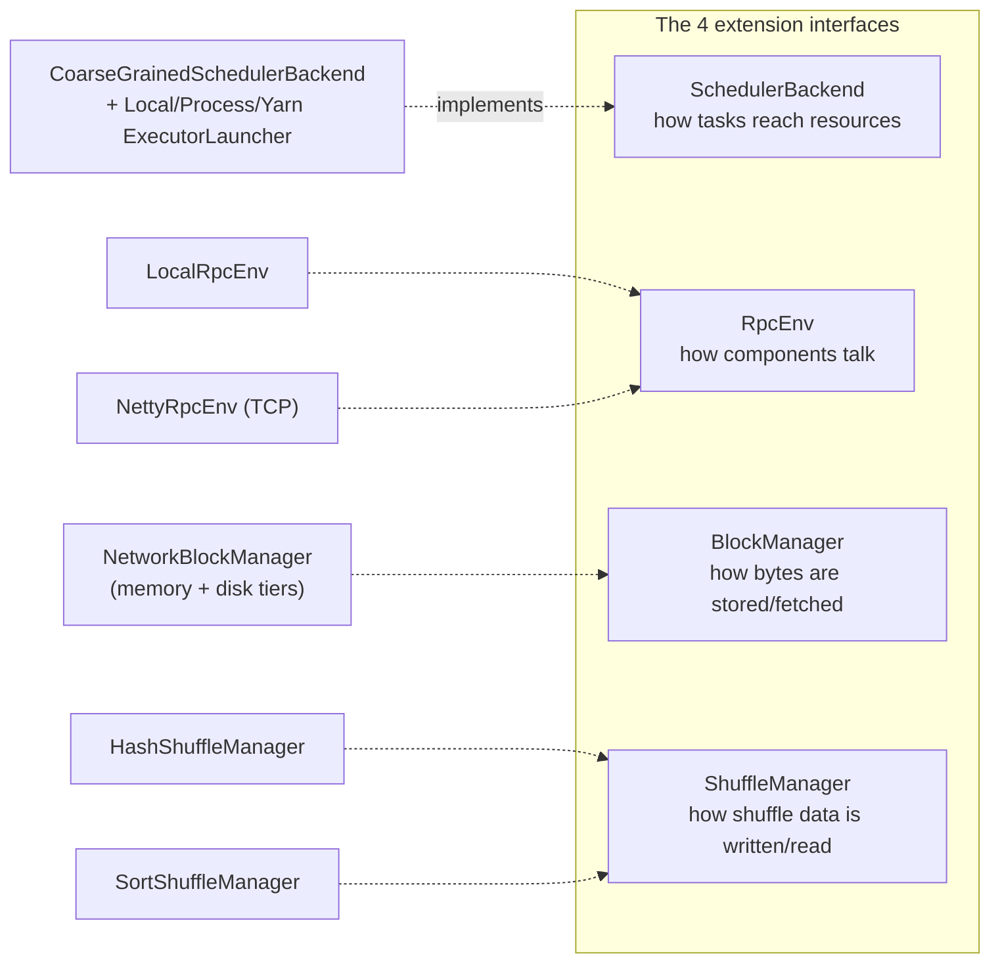
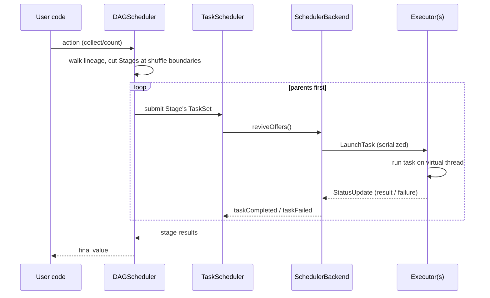

# MiniSpark — an Apache Spark clone in pure Java

A learning-grade reimplementation of Apache Spark's compute engine **and** a
YARN-like cluster manager, built from scratch in Java 21 with no Spark or
Hadoop dependency. Every class carries a `// Real Spark equivalent: …` comment
so the jump to the real Apache Spark source is direct.

It runs three ways from the same code, switched only by configuration:

| Mode | What runs | How |
|------|-----------|-----|
| **local** | driver + in-process executor, one JVM | `setMaster("local[4]")` |
| **netty** | driver + executor **JVMs** over TCP | `minispark.rpc.mode=netty` |
| **miniyarn** | RM + NodeManagers + AM + containers | `setMaster("miniyarn://host:8032")` |

The scheduler never changes across these — only implementations behind four
interfaces (`SchedulerBackend`, `RpcEnv`, `BlockManager`, `ShuffleManager`).

---

## Repository layout (5 Maven modules)

```
minispark-parent (pom)
├── minispark-rpc       messaging seam: RpcEnv (Local + Netty), Serializer
├── miniyarn            cluster manager: ResourceManager, NodeManager, ApplicationMaster
├── minispark-core      the engine: RDD, DAGScheduler, shuffle, storage, executor, web UI
├── minispark-sql       DataFrame/SQL layer (a miniature Catalyst) over the engine
└── minispark-examples  runnable demos (WordCount, SqlExample, WordCountWithUI)
```

Module dependency order: `rpc → miniyarn → core → sql → examples`.

---

## Top-level architecture

```mermaid
flowchart TB
    subgraph Driver["DRIVER JVM (your main / MiniSparkSession)"]
        APP["DataFrame / SQL  or  RDD API"]
        SQL["minispark-sql\nAnalyzer → Optimizer → Planner"]
        DAG["DAGScheduler\n(RDD lineage → Stages)"]
        TS["TaskScheduler\n(Stages → Tasks, retries, pools)"]
        BE["SchedulerBackend  «seam»"]
        APP --> SQL --> DAG --> TS --> BE
    end

    BE -. "RpcEnv «seam»\n(Local | Netty TCP)" .-> E1
    BE -. .-> E2

    subgraph E1["EXECUTOR 1"]
        R1["TaskRunner (virtual threads)"]
        BM1["BlockManager (mem+disk)"]
        SM1["ShuffleManager «seam»"]
    end
    subgraph E2["EXECUTOR 2"]
        R2["TaskRunner"]
        BM2["BlockManager"]
        SM2["ShuffleManager"]
    end

    subgraph Yarn["MiniYarn (cluster mode only)"]
        RM["ResourceManager\nFIFO/fair capacity"]
        NM1["NodeManager 1"]
        NM2["NodeManager 2"]
        AM["ApplicationMaster"]
        RM --- NM1
        RM --- NM2
        AM -. requests containers .-> RM
        NM1 -. launches .-> E1
        NM2 -. launches .-> E2
    end
```

The four seams (the heart of the design):



---

## How a job flows (RDD → result)



---

## Quick start

```bash
# Build everything and run all tests
mvn clean install

# Run WordCount in local mode
mvn -pl minispark-examples exec:java \
  -Dexec.mainClass=com.minispark.examples.WordCount \
  -Dexec.args="/path/to/book.txt"

# Run WordCount distributed (2 separate executor JVMs over TCP)
mvn -pl minispark-examples exec:java \
  -Dexec.mainClass=com.minispark.examples.WordCount \
  -Dexec.args="/path/to/book.txt" \
  -Dminispark.rpc.mode=netty \
  -Dminispark.executor.instances=2 -Dminispark.executor.cores=2

# SQL demo (DataFrame + spark.sql, with EXPLAIN)
mvn -pl minispark-examples exec:java -Dexec.mainClass=com.minispark.examples.SqlExample
```

Full operational detail — multi-process clusters, config reference, troubleshooting —
is in the **[Runbook](docs/RUNBOOK.md)**.

---

## Documentation map

| Doc | Contents |
|-----|----------|
| [**Distributed flow deep-dive**](docs/INTERNALS-DISTRIBUTED-FLOW.md) | a full distributed run traced end-to-end, mapped line-by-line to Apache Spark — **start here to learn the internals / contribute to Spark** |
| [Components overview](docs/components/README.md) | one page per subsystem, with diagrams |
| [RPC layer](docs/components/01-rpc.md) | `RpcEnv`, Local vs Netty transport, wire protocol |
| [Core engine](docs/components/02-core-engine.md) | RDD, DAGScheduler, TaskScheduler, executor |
| [Storage & shuffle](docs/components/03-storage-shuffle.md) | BlockManager tiers, hash/sort shuffle, MapOutputTracker |
| [Fault tolerance & scaling](docs/components/04-fault-tolerance-scaling.md) | retries, lineage recovery, speculation, dynamic allocation, fair pools |
| [MiniYarn](docs/components/05-miniyarn.md) | RM, NM, AM, container lifecycle |
| [SQL / DataFrame](docs/components/06-sql.md) | types, expressions, plans, analyzer, optimizer, parser |
| [Web UI & observability](docs/components/07-ui-observability.md) | event bus, status store, UI |
| [**Runbook**](docs/RUNBOOK.md) | build, run (all modes), config, scripts, troubleshooting |
| [**Multinode runbook**](docs/RUNBOOK-MULTINODE.md) | spark-submit across machines: RM + NodeManagers on a LAN, host/port/firewall reference |
| [INTERNALS](docs/INTERNALS.md) | the phase-by-phase build journal & learnings |

---

## Status

All build phases plus Tier A (engine completion), Tier B (SQL), an initial
AQE rule (post-shuffle partition coalesce), and a second join strategy
(broadcast-hash) are done. `mvn clean install` → **BUILD SUCCESS, 154 tests**
(4 rpc + 58 core + 58 sql + 34 examples). The codebase passed a high-effort
code review (10 findings, all fixed). Every distributed use case has an
integration test that spawns real executor JVMs.

Adaptive Query Execution: opt-in coalesce of post-shuffle partitions based on
real map-output sizes (`minispark.sql.adaptive.enabled=true` — see
[RUNBOOK §4](docs/RUNBOOK.md#adaptive-query-execution-aqe)). Runtime
shuffled→broadcast join demotion is not implemented yet (needs a query-stage
materialisation barrier); the compile-time path (hint + small-side detection)
is, via `df.broadcast()`. Skew-join split is not implemented yet either.
