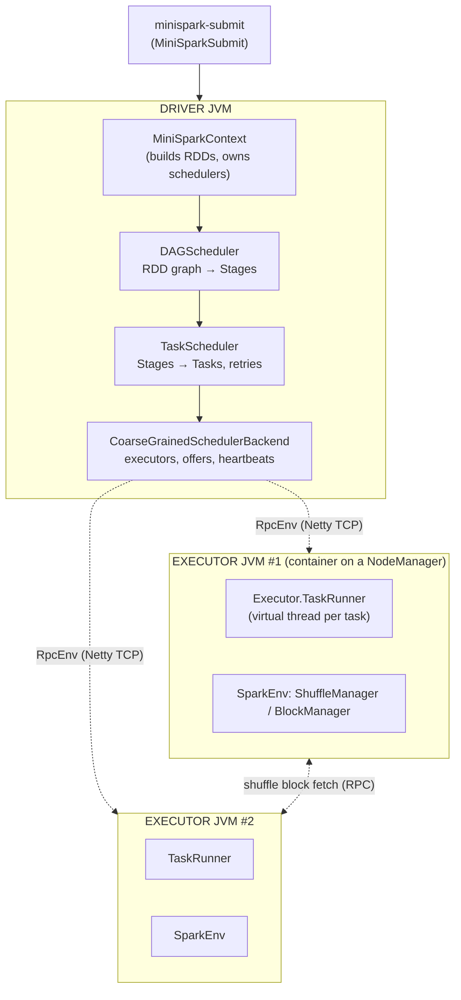
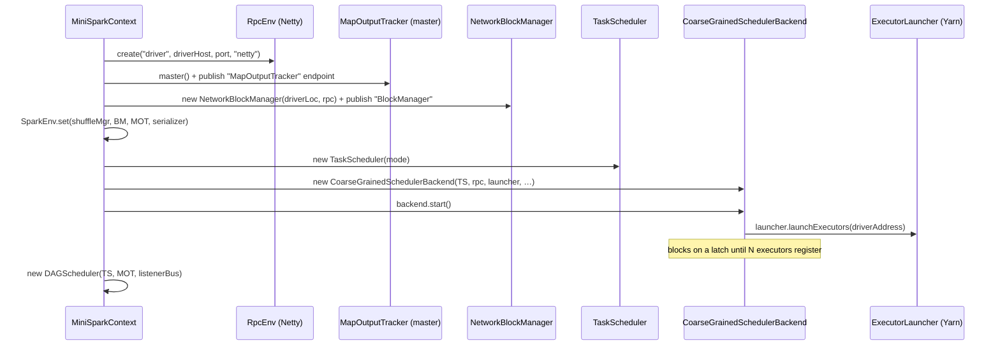
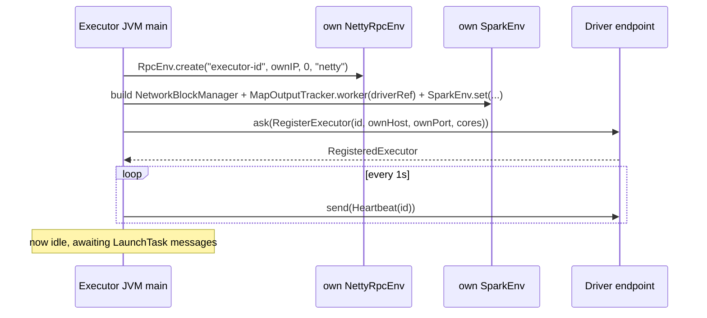
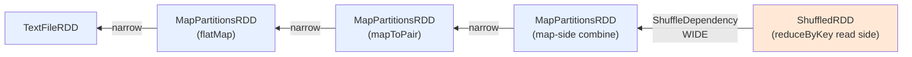
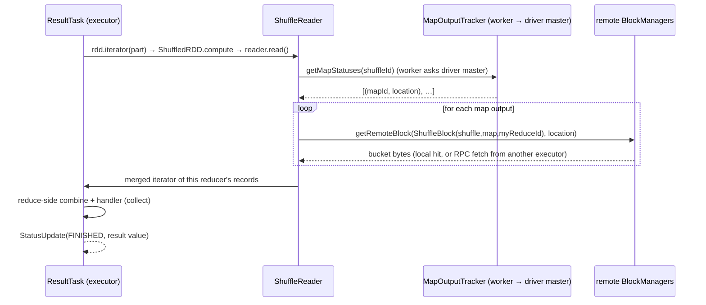
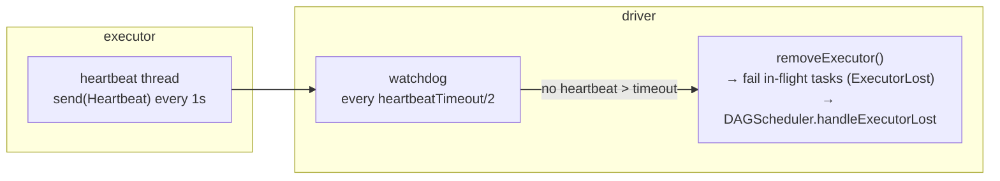
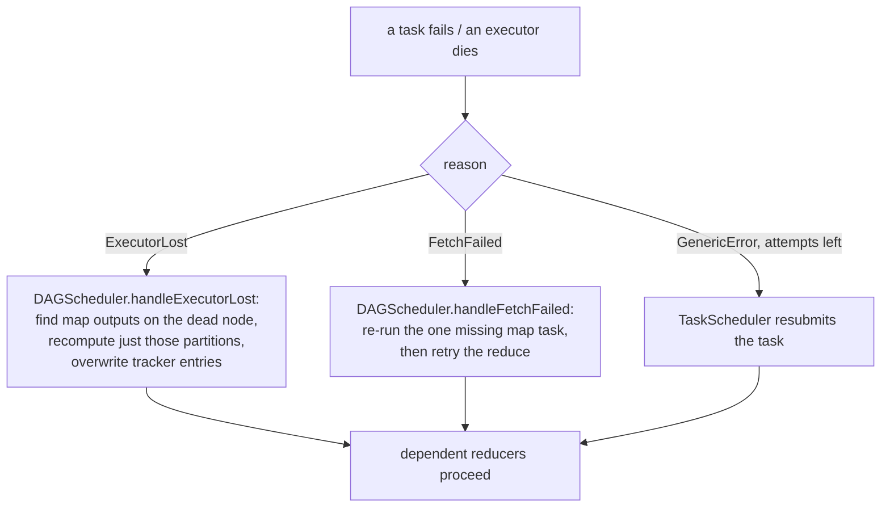
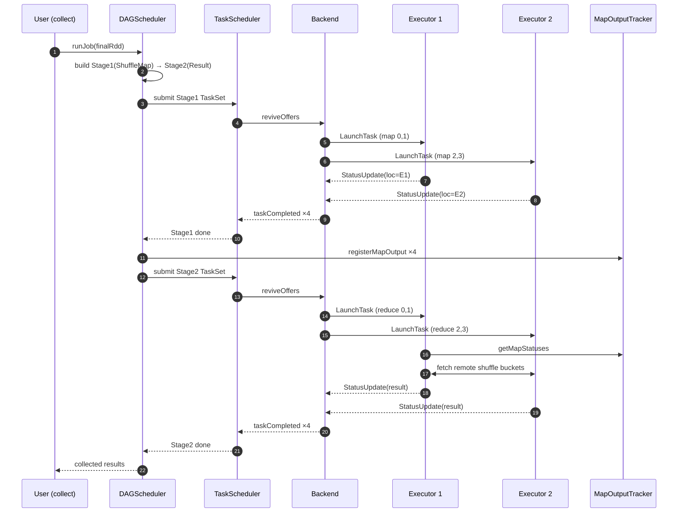

# Internals: a distributed run, end to end — and how it maps to Apache Spark

This is the document to read if you want to **understand exactly what happens
when you submit a job in distributed mode**, follow it through every component,
and come out able to read and contribute to the real Apache Spark codebase.

It traces one concrete job — a WordCount submitted to MiniYarn with 2 executors —
through every hop, citing the exact MiniSpark class/method **and** its Apache
Spark equivalent at each step. MiniSpark deliberately mirrors Spark's class names
and seams, so the mental model transfers directly.

> Companion docs: [components/](components/README.md) for per-subsystem detail,
> [RUNBOOK-MULTINODE.md](RUNBOOK-MULTINODE.md) to actually run this across hosts.

---

## 0. The job we'll trace

```java
sc.textFile("book.txt")                 // RDD[String]  (lines)
  .flatMap(line -> words(line))         // RDD[String]  (words)        ── narrow
  .mapToPair(w -> (w, 1))               // RDD[(String,Int)]           ── narrow
  .reduceByKey((a,b) -> a+b)            // RDD[(String,Int)]  ── WIDE (shuffle)
  .collect();                           // action → triggers execution
```

Submitted with:
```bash
minispark-submit --class …WordCount --master miniyarn://rm:8032 --num-executors 2
```

One `reduceByKey` ⇒ one shuffle ⇒ **two stages**: a `ShuffleMapStage`
(tokenize + map-side combine + write buckets) feeding a `ResultStage`
(read buckets + reduce-side combine + collect).

---

## 1. The 10,000-ft view



Five layers, top to bottom: **submit → context → DAGScheduler → TaskScheduler →
backend → (RPC) → executors**. Each is one swappable piece. We go down, then back up.

---

## 2. Submission — `minispark-submit` → your `main`

| Step | MiniSpark | Apache Spark |
|------|-----------|--------------|
| parse flags, set config, call app `main` | `deploy/MiniSparkSubmit.main` | `org.apache.spark.deploy.SparkSubmit` |

`MiniSparkSubmit` parses `--class/--master/--num-executors/--conf`, publishes
them as `minispark.*` **system properties**, then reflectively invokes your
app's `main(String[])`. Because the app then does `new MiniSparkConf()` (which
reads system properties), the submitted master/executor settings take effect
without the app hard-coding anything.

> **Spark contributor note:** real `SparkSubmit` is bigger (it resolves the
> deploy mode, downloads jars, sets up the `SparkClassLoader`, and for
> cluster-deploy-mode launches the driver *in the cluster*). But the essence —
> *"resolve config, set system properties, invoke the user class"* — is the
> same, and `SparkSubmit.runMain` is the method to read first.

---

## 3. Context startup — wiring the engine (driver side)

`new MiniSparkContext(conf)` — `api/MiniSparkContext.java` constructor —
builds the whole driver stack. Order matters:



| Piece | MiniSpark | Apache Spark |
|-------|-----------|--------------|
| the context | `MiniSparkContext` | `SparkContext` |
| messaging | `RpcEnv` (`NettyRpcEnv`) | `RpcEnv` (`NettyRpcEnv`) |
| per-JVM services | `executor/SparkEnv` | `SparkEnv` |
| map-output registry | `storage/MapOutputTracker` (master) | `MapOutputTrackerMaster` |
| block store | `storage/NetworkBlockManager` | `BlockManager` + `BlockManagerMaster` |
| DAG planner | `scheduler/DAGScheduler` | `DAGScheduler` |
| task dispatcher | `scheduler/TaskScheduler` | `TaskSchedulerImpl` |
| resource backend | `cluster/CoarseGrainedSchedulerBackend` | `CoarseGrainedSchedulerBackend` |

**Key idea — `SparkEnv` is a service locator.** Tasks never carry the
ShuffleManager/BlockManager inside their serialized bytes; they call
`SparkEnv.get()` on whatever JVM they land in. The driver builds one; each
executor JVM builds its own. This is exactly how Spark keeps tasks portable.

### How executors actually appear (YARN path)

`backend.start()` → `YarnExecutorLauncher.launchExecutors(driverAddress)`:

1. `ApplicationMaster.registerWithRM()` → RM assigns `app_1`.
2. `am.requestExecutors(2, …)` → `RequestContainers` to the RM.
3. RM picks the least-loaded fitting NodeManager per container, replies
   `ContainersAllocated`.
4. AM sends each owning NM a `LaunchContainer` whose command is
   `java … CoarseGrainedExecutorBackend <driverHost> <driverPort> <execId> <cores>`.
5. The NM `ProcessBuilder`-spawns that JVM.

| MiniSpark | Apache Spark |
|-----------|--------------|
| `cluster/YarnExecutorLauncher` | `o.a.s.deploy.yarn.YarnAllocator` |
| `miniyarn.am.ApplicationMaster` | `o.a.s.deploy.yarn.ApplicationMaster` |
| `miniyarn.rm.ResourceManager` | Hadoop YARN `ResourceManager` |
| `miniyarn.nm.NodeManager` | Hadoop YARN `NodeManager` |
| `cluster/CoarseGrainedExecutorBackend` | `CoarseGrainedExecutorBackend` |

---

## 4. Executor startup (worker side) — `CoarseGrainedExecutorBackend.main`

Each spawned JVM runs `cluster/CoarseGrainedExecutorBackend.main`:



Two things to internalize:

1. **The executor builds its *own* `SparkEnv`** with a *worker* MapOutputTracker
   (it asks the driver-master for map locations) and its own BlockManager
   (serves/fetches blocks). Same code, different role — mirrors Spark's
   `MapOutputTrackerWorker` vs `…Master`.
2. **Registration is the rendezvous.** The executor dials the driver's published
   address (the `<driverHost>` baked into its launch command) and `ask`s to
   register. The driver's `backend.start()` latch releases once all executors
   are in. (`CoarseGrainedExecutorBackend.onStart`.)

---

## 5. The action fires — building the Stage DAG

`collect()` → `MiniSparkContext.runJob` → `DAGScheduler.runJob`
(`scheduler/DAGScheduler.java:116`).

The DAGScheduler walks the RDD lineage **backwards** from the final RDD,
cutting a new stage at every `ShuffleDependency`:



- `discoverShuffleAncestors` (`:193`) DFS-walks dependencies. A
  `ShuffleDependency` ⇒ `getOrCreateShuffleMapStage` (`:214`); a narrow dep ⇒
  keep walking inside the current stage.
- Result: **Stage 1** `ShuffleMapStage` (TextFile→flatMap→mapToPair→combine,
  all narrow, fused) and **Stage 2** `ResultStage` (the ShuffledRDD + collect).
- Stages are submitted **parents-first**: Stage 1 must finish (and its outputs
  be registered) before Stage 2's reducers can fetch.

| MiniSpark | Apache Spark |
|-----------|--------------|
| `DAGScheduler.runJob` / `submitStage` | `DAGScheduler.runJob` / `submitStage` |
| `ShuffleMapStage`, `ResultStage` | same names |
| `discoverShuffleAncestors` | `getOrCreateParentStages` / `getShuffleDependencies` |

**This is the single most important Spark concept.** A *narrow* dependency
(child partition reads a bounded, known set of parent partitions) pipelines
within a stage. A *wide* dependency (child partition needs *all* parent
partitions, grouped by key) forces the parent output to be materialized to disk/
memory by key first — and that materialization point **is** the stage boundary.

---

## 6. Stage 1 executes — map tasks, the shuffle write

`submitShuffleMapStage` (`:234`) builds one `ShuffleMapTask` per partition and
hands the `TaskSet` to the TaskScheduler:

```mermaid
sequenceDiagram
    participant DAG as DAGScheduler
    participant TS as TaskScheduler
    participant BE as Backend (DriverEndpoint)
    participant EX as Executor JVM
    participant SW as ShuffleWriter (on executor)
    participant MOT as MapOutputTracker (driver master)
    DAG->>TS: submitTasks(TaskSet stage1)  → returns a CompletableFuture
    TS->>BE: reviveOffers()
    BE->>BE: makeOffers(): match tasks to free cores (locality-aware)
    BE->>EX: send(LaunchTask(stage, part, serialized task bytes))
    EX->>EX: TaskRunner: deserialize → ShuffleMapTask.run(ctx)
    EX->>SW: rdd.iterator(part) → records ; writer.write(records)
    Note over SW: partition by HashPartitioner into R buckets,<br/>store each as a ShuffleBlock in local BlockManager
    EX-->>BE: send(StatusUpdate(FINISHED, result = ExecutorLocation))
    BE->>TS: taskCompleted(stage, part, location)
    TS-->>DAG: future completes when all map tasks done
    DAG->>MOT: registerMapOutput(shuffleId, mapId, location)  (per task)
```

Trace it in code:

1. **Dispatch.** `TaskScheduler.submitTasks` (`:158`) records per-partition state
   and calls `backend.reviveOffers()`. `CoarseGrainedSchedulerBackend.makeOffers`
   (`:241`) sorts pending tasks by pool rank, picks a free-core executor via
   `LocalityScheduler.select`, **serializes the task**, and sends
   `LaunchTask` over RPC (`:277`).
2. **Run.** On the executor, `Executor.launchTask` (`executor/Executor.java:51`)
   submits to a **virtual-thread** pool: deserialize the task, build a
   `TaskContext`, call `task.run(ctx)`.
3. **Map work + shuffle write.** `ShuffleMapTask.run` (`:41`) does
   `rdd.iterator(partition, ctx)` (which applies caching/lineage, else
   `compute()`), then `SparkEnv.get().shuffleManager().getWriter(...).write(records)`.
   `HashShuffleManager.HashWriter.write` (`:81`) buckets records by
   `partitioner.getPartition(key)` into R lists and stores each as a
   `ShuffleBlock` in the **local** BlockManager. It returns the executor's
   `ExecutorLocation`.
4. **Register outputs.** The task's result *is* its location. Back on the driver,
   `DAGScheduler` registers each with the master `MapOutputTracker` (`:274`) —
   so reducers can later find where each bucket lives.

| MiniSpark | Apache Spark |
|-----------|--------------|
| `Executor.launchTask` / `TaskRunner` | `Executor.launchTask` / `TaskRunner` |
| `ShuffleMapTask.run` | `ShuffleMapTask.runTask` |
| `HashShuffleManager.HashWriter` | `SortShuffleWriter` / `BypassMergeSortShuffleWriter` |
| returns `ExecutorLocation` | returns `MapStatus` |
| `MapOutputTracker.registerMapOutput` | `MapOutputTrackerMaster.registerMapOutput` |

---

## 7. Stage 2 executes — reduce tasks, the shuffle read

Once Stage 1's outputs are registered, `submitResultStage` (`:370`) submits
`ResultTask`s. Each reducer:



Trace it:

1. `ShuffledRDD.compute` calls `SparkEnv.get().shuffleManager().getReader(...).read()`.
2. `HashShuffleManager.HashReader.read` (`:142`) asks the tracker
   `getMapStatuses(shuffleId)` — on an executor this is a *worker* tracker that
   RPCs the driver master — then for each map output fetches its bucket via
   `blockManager.getRemoteBlock(...)` (`:154`): a local hit if the block is on
   this executor, otherwise an RPC fetch from the executor that produced it.
3. The merged records flow into the reduce-side combine and the user's
   `collect` handler. Results return to the driver as `StatusUpdate`s.

| MiniSpark | Apache Spark |
|-----------|--------------|
| `ResultTask.run` | `ResultTask.runTask` |
| `ShuffledRDD.compute` | `ShuffledRDD.compute` |
| `HashShuffleManager.HashReader` | `BlockStoreShuffleReader` |
| `getRemoteBlock` (RPC) | `BlockManager` + `ShuffleBlockFetcherIterator` |

---

## 7.5. AQE coalesce — optional re-plan between map and reduce

> Real Spark equivalent: `org.apache.spark.sql.execution.adaptive.CoalesceShufflePartitions`,
> applied by `AdaptiveSparkPlanExec` between query stages.

Set `minispark.sql.adaptive.enabled=true` and a second thing happens before
Stage 2 is submitted: `DAGScheduler.maybeCoalesceShuffles` walks the result
RDD's narrow lineage to every `ShuffledRDD`, asks `MapOutputTracker` for the
just-published per-reducer byte totals (`getReducerSizes`), and runs
`CoalesceShufflePartitionsRule.plan(sizes, targetBytes, minPartitions)` to
produce a list of `[startReducerId, endReducerId)` ranges. Each range becomes
one post-shuffle partition — `ShuffledRDD.applyCoalescedRanges` rebuilds its
internal slice list, and `compute()` reads the wider range via
`getReader(handle, start, end)` (the reader signature already supported ranges
since day one).

So when WordCount's reduce side has 16 reducer ids carrying 8 MiB total and
the target is 64 MiB, Stage 2 ships **one** ResultTask instead of sixteen.
The map side is untouched: writers still partition into 16 buckets. Only the
read groupings collapse, which is exactly the AQE shape.

Why it's gated to the final stage: a downstream `ShuffleMapStage` would be
written against the parent's stated partitioner, and coalescing changes the
post-shuffle partition count, breaking that contract. So the recursion stops
at any nested `ShuffleDependency` — only shuffles whose consumer is the
ResultStage are eligible. (Real Spark AQE handles this with explicit query-stage
boundaries; the simplification here is the same idea applied bluntly.)

Both follow-on AQE rules from the original write-up are now in place. The
SMJ→broadcast demotion lives one layer up at the SQL planner as
`AdaptiveJoinExec` (it materialises the join's children to learn their
actual sizes, then chooses among broadcast / shuffled-hash / sort-merge
operators at execute time). The skew-split rule
(`OptimizeSkewedPartitionsRule`) lives right here in the same
`maybeCoalesceShuffles` hook: it reads per-(map,reducer) byte cells from
`MapOutputTracker.getMapSizesPerReducer`, detects reducers far above the
non-skewed median, and replaces their single-reducer slice with N
sub-slices each carrying a `[startMapId, endMapId)` range — the same
`ShuffleReader` API that supports reducer-id ranges was extended once to
also slice by map id, and the `HashShuffleManager`/`SortShuffleManager`
readers filter their map iteration by that bound.

The remaining caveat — skew-split is only correct for "stateless"
downstream consumers (`collect`, narrow per-record ops). Key-aware
operators (`groupByKey`/`reduceByKey`/`cogroup`) assume one-key-per-partition
and would produce partial groups under a split. Real Spark sidesteps this
by applying skew-split only inside joins with the matching other-side
replication; ours operates at the RDD level so the rule is off by default,
explicit opt-in via `minispark.sql.adaptive.skewJoin.enabled`.

---

## 8. Back up the stack — results to the user

`TaskScheduler.taskCompleted` (`:219`) records each result; when a stage's last
task reports, it completes the stage `CompletableFuture`. `DAGScheduler.runJob`
was blocked on that future, unblocks, returns the ordered results to
`MiniSparkContext.runJob`, which returns them to `collect()`. **Done.**

---

## 9. The control-plane loop (always running underneath)

Two periodic loops keep the cluster honest:



- **Heartbeats** (`CoarseGrainedExecutorBackend.sendHeartbeat`) →
  driver updates `lastHeartbeatMs`.
- **Watchdog** (`CoarseGrainedSchedulerBackend.checkHeartbeats:229`) marks an
  executor lost after `heartbeatTimeoutMs`, fails its in-flight tasks as
  `ExecutorLost`, and notifies the DAGScheduler.

| MiniSpark | Apache Spark |
|-----------|--------------|
| `Heartbeat` / `checkHeartbeats` | `HeartbeatReceiver` |
| `TaskFailureReason` (sealed) | `TaskEndReason` hierarchy |

---

## 10. When things fail — fault tolerance (the "R" in RDD)

This is where MiniSpark earns the name *Resilient* — and where Spark's design
genuinely shines. Three failure paths:



- **Task retry** — `TaskScheduler.taskFailed` (`:250`) retries up to
  `maxAttempts`; duplicate completions are ignored (first success wins).
- **Lost executor** — `DAGScheduler.handleExecutorLost` (`:293`) enumerates the
  dead node's map outputs (`MapOutputTracker.mapsAtLocation`), submits a fresh
  recovery `TaskSet` to recompute *only* those partitions, and **overwrites** the
  tracker entries by mapId (never removes first — so a concurrent reducer always
  sees a complete `numMaps` set).
- **Fetch failed** — `handleFetchFailed` (`:319`) rebuilds the single missing
  map output and resubmits the reduce.

No replication, no checkpointing required: the lineage *is* the recovery plan.
`ExecutorFailureRecoveryTest` kills an executor mid-job and proves the result is
still correct. Real Spark does exactly this in `DAGScheduler.handleTaskCompletion`
on a `FetchFailed`, and resubmits stages.

| MiniSpark | Apache Spark |
|-----------|--------------|
| `DAGScheduler.handleExecutorLost` | `DAGScheduler.handleExecutorLost` |
| `DAGScheduler.handleFetchFailed` | `DAGScheduler` FetchFailed branch + stage resubmit |
| lineage recompute | the defining RDD property (`RDD.compute` + dependencies) |

---

## 11. The four seams — why "local" and "distributed" are the same code

Everything above is identical in local mode; only the implementation behind four
interfaces changes. **Internalizing these seams is the fastest way to navigate
Spark's source.**

| Seam (interface) | MiniSpark local | MiniSpark distributed | Spark |
|------------------|-----------------|-----------------------|-------|
| `SchedulerBackend` — tasks→resources | `LocalExecutorLauncher` | `Process`/`Yarn` launcher | `LocalSchedulerBackend` vs `CoarseGrained…` |
| `RpcEnv` — components talk | `LocalRpcEnv` | `NettyRpcEnv` | `NettyRpcEnv` |
| `BlockManager` — store/fetch bytes | in-memory | `NetworkBlockManager` (RPC) | `BlockManager` + transfer service |
| `ShuffleManager` — shuffle I/O | `HashShuffleManager` | `Sort`/`Hash` | `SortShuffleManager` |

The `DAGScheduler` and `TaskScheduler` import **none** of the concrete classes —
only the interfaces. That's why a job runs unchanged across local, netty, and
YARN. Spark enforces the same discipline.

---

## 12. The full picture in one sequence



---

## 13. Your on-ramp to contributing to Apache Spark

You now know the shape. Map it onto the real source and pick a first issue:

### Read these Spark files in this order
1. **`core/…/rdd/RDD.scala`** — `compute`, `getPartitions`, `dependencies`,
   the transformation methods. (MiniSpark: `rdd/RDD.java`.)
2. **`core/…/scheduler/DAGScheduler.scala`** — `submitStage`,
   `getOrCreateParentStages`, `handleTaskCompletion` (esp. the `FetchFailed`
   branch). The biggest, most important file. (MiniSpark: `scheduler/DAGScheduler.java`.)
3. **`core/…/scheduler/TaskSchedulerImpl.scala`** + **`TaskSetManager.scala`** —
   offers, locality, retries, speculation. (MiniSpark: `scheduler/TaskScheduler.java`
   + `scheduler/pool/*`.)
4. **`core/…/executor/Executor.scala`** — `TaskRunner.run`. (MiniSpark: `executor/Executor.java`.)
5. **`core/…/shuffle/…`** and **`storage/BlockManager.scala`** — the data plane.
   (MiniSpark: `shuffle/*`, `storage/*`.)
6. **`core/…/rpc/netty/NettyRpcEnv.scala`** — the transport. (MiniSpark: `rpc/NettyRpcEnv.java`.)

### Mental-model differences to expect in real Spark
- **Scala, not Java**; events flow through an **event loop** (`DAGSchedulerEventProcessLoop`)
  rather than direct calls — Spark posts `JobSubmitted`/`CompletionEvent` to a
  queue. MiniSpark calls methods directly; same logic, different plumbing.
- **`MapStatus`** carries per-reducer sizes (for skew/locality), not just a
  location. **Sort shuffle** writes one indexed file + spills; MiniSpark keeps
  it in memory.
- **TaskSetManager** owns retries/locality per stage attempt; MiniSpark folds
  this into `TaskScheduler`.
- **Tungsten / whole-stage codegen / Catalyst** sit above this in SQL — but the
  RDD execution layer you just traced is what they ultimately compile down to.

### Good first-contribution areas (where this knowledge pays off)
- **Scheduler**: locality, speculation, blacklisting/excludeOnFailure, barrier
  execution — all live in the files you now understand.
- **Shuffle/storage**: the read path, block fetch retries, push-based shuffle.
- **Docs/tests**: the surest first PR — you can now read a scheduler test and
  know what it asserts.

Start at [issues.apache.org/jira/projects/SPARK](https://issues.apache.org/jira/projects/SPARK)
filtered to `starter` label, or the `core` component, and trace the bug through
the same path you traced here.

---

## Appendix — MiniSpark → Apache Spark class cheat sheet

| Concept | MiniSpark | Apache Spark |
|---------|-----------|--------------|
| submit | `deploy.MiniSparkSubmit` | `deploy.SparkSubmit` |
| context | `api.MiniSparkContext` | `SparkContext` |
| config | `api.MiniSparkConf` | `SparkConf` |
| per-JVM services | `executor.SparkEnv` | `SparkEnv` |
| RDD | `rdd.RDD` (+ `MapPartitionsRDD`, `ShuffledRDD`, …) | `rdd.RDD` (same) |
| dependency | `rdd.{Narrow,Shuffle}Dependency` | same |
| DAG planner | `scheduler.DAGScheduler` | `scheduler.DAGScheduler` |
| stages/tasks | `scheduler.{ShuffleMapStage,ResultStage,…Task}` | same names |
| AQE coalesce | `scheduler.adaptive.CoalesceShufflePartitionsRule` | `sql.execution.adaptive.CoalesceShufflePartitions` |
| per-map size report | `scheduler.MapTaskOutput` | `scheduler.MapStatus` (with size array) |
| shuffled hash join | `sql.execution.ShuffledHashJoinExec` | same |
| broadcast hash join | `sql.execution.BroadcastHashJoinExec` | same |
| sort-merge join | `sql.execution.SortMergeJoinExec` | same |
| zip two RDDs per partition | `rdd.ZippedPartitionsRDD2` | same |
| broadcast hint | `sql.plan.BroadcastHint` / `DataFrame.broadcast()` | `ResolvedHint(_, HintInfo(BROADCAST))` |
| AQE join wrapper (runtime demote) | `sql.execution.AdaptiveJoinExec` | `sql.execution.adaptive.{AdaptiveSparkPlanExec, DemoteBroadcastHashJoin}` |
| materialised intermediate scan | `sql.execution.MaterializedRDDScanExec` | `sql.execution.adaptive.QueryStageExec` |
| AQE skew partition split | `scheduler.adaptive.OptimizeSkewedPartitionsRule` | `sql.execution.adaptive.OptimizeSkewedJoin` |
| per-(map,reducer) byte sizes | `MapOutputTracker.getMapSizesPerReducer` | `MapStatus.getSizeForBlock(reduceId)` |
| window functions | `sql.expr.window.{WindowFunction, RankingFunctions, WindowSpec, WindowExpression}` | `catalyst.expressions.{WindowFunction, RowNumber/Rank/DenseRank, WindowSpec, WindowExpression}` |
| Window logical/physical | `sql.plan.Window` / `sql.execution.WindowExec` | same |
| Window builder | `sql.Window` (static factory) | `sql.expressions.Window` |
| task dispatcher | `scheduler.TaskScheduler` | `TaskSchedulerImpl` + `TaskSetManager` |
| backend | `cluster.CoarseGrainedSchedulerBackend` | same |
| executor backend | `cluster.CoarseGrainedExecutorBackend` | same |
| executor | `executor.Executor` | `executor.Executor` |
| RPC | `rpc.{RpcEnv,NettyRpcEnv,RpcEndpoint(Ref)}` | same names |
| block store | `storage.{BlockManager,NetworkBlockManager}` | `BlockManager` (+Master) |
| map outputs | `storage.MapOutputTracker` | `MapOutputTracker{Master,Worker}` |
| shuffle | `shuffle.{Hash,Sort}ShuffleManager` | `SortShuffleManager` |
| broadcast | `broadcast.TorrentBroadcast` | `broadcast.TorrentBroadcast` |
| accumulators | `accumulator.Accumulator` | `util.AccumulatorV2` |
| cluster mgr | `miniyarn.{rm,nm,am}` | YARN + `deploy.yarn.*` |
| SQL plans | `sql.plan.*`, `sql.execution.*` | Catalyst `LogicalPlan` / `SparkPlan` |
| event/UI | `status.LiveListenerBus` / `ui.MiniSparkUI` | `LiveListenerBus` / `SparkUI` |
