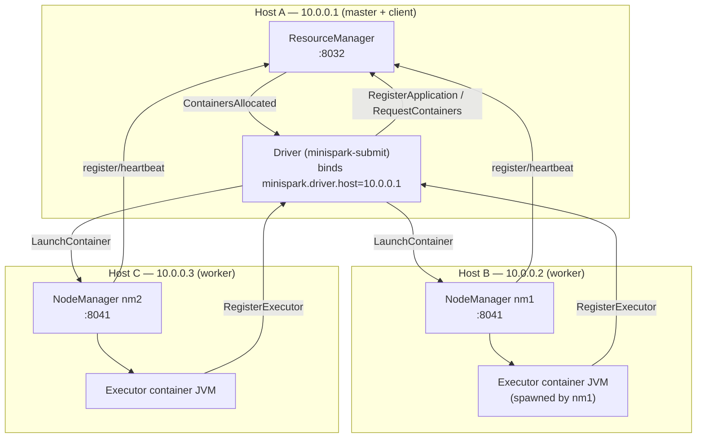

# MiniSpark Multinode Runbook — spark-submit across real machines

This runbook walks through running MiniSpark **across several physical/virtual
machines on a LAN**: a ResourceManager on one host, NodeManagers on others, and
a job submitted with `minispark-submit --master miniyarn://…` that lands real
executor JVMs on the worker nodes.

For single-host usage see **[RUNBOOK.md](RUNBOOK.md)**; for architecture see
**[components/](components/README.md)**.

> **The one rule that makes multinode work:** every component must bind to and
> advertise a **routable IP** (the host's LAN address), never `127.0.0.1`.
> `127.0.0.1` only loops back to the same machine, so a NodeManager or executor
> that advertises it can never be reached from another host. Every step below
> calls out the host/IP argument explicitly.

---

## 1. Topology



In this example:

| Host | IP | Runs |
|------|----|----|
| A | `10.0.0.1` | ResourceManager **and** the submitting client (driver) |
| B | `10.0.0.2` | NodeManager `nm1` |
| C | `10.0.0.3` | NodeManager `nm2` |

(The RM and client can be separate hosts too; just point everything at the RM's IP.)

---

## 2. Prerequisites on every host

1. **Java 21** and **Maven** installed.
2. **The same MiniSpark build on every host** — the executor child JVM is
   launched with the NodeManager's classpath, so worker nodes need the compiled
   classes/deps. Two options:
   - Check out the repo and run `mvn -q -am -pl minispark-examples install -DskipTests`
     on each host (simplest), **or**
   - Build once and copy the whole repo (including `*/target/classes` and the
     resolved dependency jars) to each host at the same path.
3. **Network reachability + open ports** between hosts:

   | From | To | Port (default) | Purpose |
   |------|----|----|---------|
   | NodeManagers, client | RM host | `8032` | RM RPC |
   | RM, client, executors | each NM host | NM port (e.g. `8041`) | NM RPC + container mgmt |
   | executors | client/driver host | driver port (pick one, e.g. `7077`) | RegisterExecutor, tasks, block fetch |
   | executors | other executors | their ephemeral ports | shuffle/broadcast block fetch |

   On a LAN, open the fixed ports (`8032`, the NM ports, the driver port) and
   allow the ephemeral range between worker hosts. Verify with
   `nc -vz <ip> <port>` from each side before proceeding.

> **Find a host's routable IP:** `hostname -I | awk '{print $1}'` (Linux) — use
> that value wherever this runbook says `10.0.0.x`.

---

## 3. Bring up the cluster

The `scripts/start-*.sh` helpers take explicit host/port arguments — use the
**routable IP**, not the default `127.0.0.1`.

### 3.1 Host A — ResourceManager

```bash
# scripts/start-rm.sh [host] [port]
scripts/start-rm.sh 10.0.0.1 8032
```
Logs: `ResourceManager listening at 10.0.0.1:8032`.

### 3.2 Host B — NodeManager nm1

```bash
# scripts/start-nm.sh <name> [rmHost] [rmPort] [host] [port] [cores] [memMB]
#                                                ^^^^^^ this host's routable IP
scripts/start-nm.sh nm1 10.0.0.1 8032 10.0.0.2 8041 4 4096
```
On the RM you should see: `Registered NodeManager nm1 at 10.0.0.2:8041 …`.

> The 4th arg (`host`) is what the NM **advertises to the RM**, and what the AM
> uses to send it `LaunchContainer`. It must be `10.0.0.2`, not `127.0.0.1`,
> or the AM on Host A can't reach the NM. Use a fixed `port` (here `8041`) so
> it's firewall-friendly; `0` would pick an ephemeral port (fine if that range
> is open).

### 3.3 Host C — NodeManager nm2

```bash
scripts/start-nm.sh nm2 10.0.0.1 8032 10.0.0.3 8041 4 4096
```
RM: `Registered NodeManager nm2 at 10.0.0.3:8041 …`.

Repeat for as many workers as you want; each registers its capacity with the RM.

---

## 4. Submit a job (the spark-submit equivalent)

From **Host A** (the client). The critical extra flag versus single-host is
`--conf minispark.driver.host=<this host's routable IP>` so the executor JVMs on
the worker nodes can dial the driver back.

```bash
scripts/minispark-submit.sh \
  --class com.minispark.examples.WordCount \
  --master miniyarn://10.0.0.1:8032 \
  --num-executors 2 \
  --executor-cores 2 \
  --executor-memory 256 \
  --conf minispark.driver.host=10.0.0.1 \
  --conf minispark.driver.port=7077 \
  /shared/data/book.txt
```

What happens (watch the RM and NM consoles):

```mermaid
sequenceDiagram
    participant C as Client/Driver (Host A)
    participant RM as ResourceManager (Host A)
    participant NM1 as NodeManager (Host B)
    participant NM2 as NodeManager (Host C)
    participant E as Executor JVMs
    C->>RM: RegisterApplication(app_1)
    C->>RM: RequestContainers(2, 2 cores, 256MB)
    RM->>RM: place across nm1 (B) and nm2 (C)
    RM-->>C: ContainersAllocated([c1@B, c2@C])
    C->>NM1: LaunchContainer(c1, cmd points at driver 10.0.0.1:7077)
    C->>NM2: LaunchContainer(c2, …)
    NM1->>E: spawn executor JVM
    NM2->>E: spawn executor JVM
    E->>C: RegisterExecutor (dials 10.0.0.1:7077)
    C->>E: LaunchTask …
    Note over C,E: stages run; shuffle blocks fetched executor↔executor
```

> **The input path must be reachable on the worker hosts.** `textFile` /
> `spark.read` open the path on whichever executor runs the task. Use a shared
> mount (NFS/`/shared`) or copy the file to the same path on every worker.
> Single-host runs don't hit this because every task is on the same machine.

Output (WordCount prints `<word>\t<count>` on the client's stdout):
```
the     9
fox     7
dog     4
...
```

---

## 5. Config reference for multinode

Beyond the [single-host config](RUNBOOK.md#4-configuration-reference), these
control cross-host wiring:

| Key / flag | Set on | Must be |
|------------|--------|---------|
| RM `host` arg | RM host | RM's routable IP (`10.0.0.1`) |
| NM `host` arg (4th) | each worker | that worker's routable IP |
| NM `rmHost`/`rmPort` args | each worker | the RM's IP/port |
| `--master miniyarn://IP:PORT` | client | the RM's IP/port |
| `minispark.driver.host` | client | the client's routable IP |
| `minispark.driver.port` | client | a fixed open port (else ephemeral) |
| `minispark.executor.instances` | client | total executors to request |
| `minispark.executor.cores` / `.memoryMB` | client | per-container shape (must fit a NM) |

The driver forwards `minispark.shuffle.manager`, `minispark.memory.store.maxBytes`,
and `minispark.local.dir` to the executor JVMs automatically, so set those once
on the submit line with `--conf`.

---

## 6. Verifying & observing

- **RM console** — `Registered NodeManager …` (one per worker), then
  `App app_1 requested N containers` and the allocations.
- **NM consoles** — `Launched app_1_container_X on node nmY (pid …)`.
- **Client console** — `Registered executor app_1_container_X at <workerIP>:<port>`,
  then stage completions and the job result.
- **Web UI** (optional): add `--conf minispark.ui.enabled=true --conf minispark.ui.host=10.0.0.1 --conf minispark.ui.port=4040`
  and browse `http://10.0.0.1:4040/` for live executors/jobs/stages.

A permanent automated proof of this exact chain (RM + 2 NMs + submit) runs in
`SubmitMiniYarnTest` (single-host, ports bound per-component) — the multinode
case is the same wiring with routable IPs instead of loopback.

---

## 7. Troubleshooting (multinode-specific)

| Symptom | Cause | Fix |
|---------|-------|-----|
| `Only 0/N executors registered after timeout` | executors can't reach the driver | set `minispark.driver.host` to the client's **routable IP** (not 127.0.0.1) and open the driver port |
| RM never logs a NodeManager | NM can't reach the RM, or NM advertised 127.0.0.1 | check NM `rmHost`/`rmPort`; set the NM `host` arg to the worker's routable IP |
| AM gets allocations but containers never launch | AM (on client) can't reach the NM | NM `host` must be routable from the client; open the NM port |
| `FetchFailed` / job stalls in the reduce stage | executors can't reach each other for shuffle | open the ephemeral port range between worker hosts |
| `Cannot stat /path` on a worker | input file not present on that host | use a shared mount or copy the file to the same path everywhere |
| `ClassNotFoundException` in an executor | worker doesn't have the build | install/copy the repo (with `target/classes` + deps) to every worker at the same path |
| Executor binds the wrong NIC | `getLocalHost()` resolved a non-routable address | ensure the worker's hostname resolves to its LAN IP (`/etc/hosts`), or run the NM/executor on a host with a single routable interface |
| Connection refused after a while | firewall dropped an idle connection | keep the fixed ports open; heartbeats (1s) normally keep links warm |

### Quick connectivity preflight (run from each worker)
```bash
nc -vz 10.0.0.1 8032     # can I reach the RM?
nc -vz 10.0.0.1 7077     # can I reach the driver port?
```
And from the client:
```bash
nc -vz 10.0.0.2 8041     # can I reach nm1?
nc -vz 10.0.0.3 8041     # can I reach nm2?
```

---

## 8. Tear down

Stop the client job (it exits when the action completes). Then `Ctrl-C` each
NodeManager and the ResourceManager. Stray executor JVMs (if a worker was killed
mid-job) can be cleaned with:
```bash
# on each worker
kill -9 $(ps -ef | grep '[C]oarseGrainedExecutorBackend' | awk '{print $2}')
```
