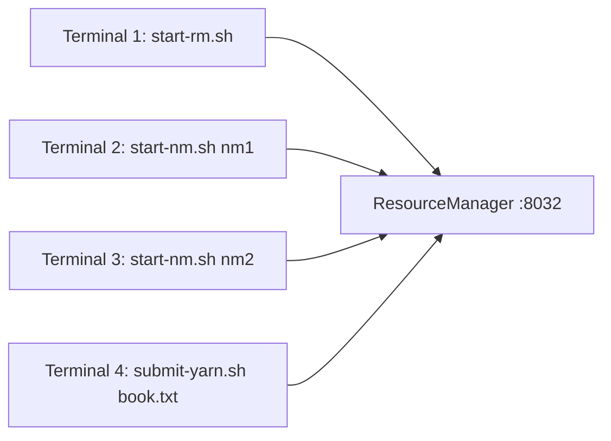

# MiniSpark Runbook

Operational guide: build, run in every mode, configure, and troubleshoot.
For architecture see the [component docs](components/README.md).

---

## 1. Prerequisites

- **Java 21** (uses virtual threads, records, sealed types, pattern switch).
- **Maven** (a wrapper `mvnw`/`mvnw.cmd` may be provided; otherwise system `mvn`).
- No Spark/Hadoop install — everything is self-contained.

Verify:
```bash
java -version    # must be 21+
mvn -version
```

---

## 2. Build & test

```bash
# Compile all modules, run the full test suite, install to the local repo
mvn clean install

# Compile only (skip tests)
mvn clean install -DskipTests

# Test a single module
mvn -pl minispark-sql test

# Run one test class
mvn -pl minispark-core test -Dtest=DAGSchedulerStagesTest
```

Expected: **BUILD SUCCESS**, ~109 tests (4 rpc + 49 core + 49 sql + 7 examples).

> Module build order is `rpc → miniyarn → core → sql → examples`. When running a
> single downstream module with `exec:java`, add `-am` (also-make) the first time
> so its dependencies are installed: `mvn -pl minispark-examples -am install -DskipTests`.

---

## 3. Run modes

### 3.1 Local mode (one JVM)

The default. Driver and a single in-process executor; `local[N]` sets task slots.

```bash
mvn -pl minispark-examples -am install -DskipTests
mvn -pl minispark-examples exec:java \
  -Dexec.mainClass=com.minispark.examples.WordCount \
  -Dexec.args="/path/to/book.txt"
```

In code:
```java
new MiniSparkConf().setAppName("wc").setMaster("local[4]");
```

### 3.2 Distributed on one host (Netty, separate executor JVMs)

Driver spawns N executor **JVMs** that connect back over TCP. No cluster manager.

```bash
mvn -pl minispark-examples exec:java \
  -Dexec.mainClass=com.minispark.examples.WordCount \
  -Dexec.args="/path/to/book.txt" \
  -Dminispark.rpc.mode=netty \
  -Dminispark.executor.instances=2 \
  -Dminispark.executor.cores=2
```

You'll see `Spawned executor JVM proc-0 …` and `Registered executor …` in the
logs. Convenience script: `scripts/submit.sh /path/to/book.txt` (env vars
`EXECUTORS`, `CORES`).

### 3.3 Cluster mode (MiniYarn)

Run the ResourceManager and NodeManagers as **separate processes**, then submit.



```bash
# Terminal 1 — ResourceManager (binds 127.0.0.1:8032 by default)
scripts/start-rm.sh

# Terminal 2 — NodeManager nm1 (4 cores, 4 GB by default)
scripts/start-nm.sh nm1

# Terminal 3 — NodeManager nm2
scripts/start-nm.sh nm2

# Terminal 4 — submit WordCount through the cluster
scripts/submit-yarn.sh /path/to/book.txt
#   env: RMHOST RMPORT EXECUTORS CORES MEM
```

In code, the only change is the master URL:
```java
new MiniSparkConf()
    .setMaster("miniyarn://127.0.0.1:8032")
    .set("minispark.executor.instances", "4")
    .set("minispark.executor.cores", "2")
    .set("minispark.executor.memoryMB", "512");
```

Windows: use the `.cmd` equivalents (`scripts\start-rm.cmd`, `start-nm.cmd`,
`submit-yarn.cmd`).

### 3.4 With the web UI

```bash
scripts/run-ui-demo.sh                 # prints http://127.0.0.1:4040/
```
or set `-Dminispark.ui.enabled=true -Dminispark.ui.port=4040` on any run.

### 3.5 SQL demo

```bash
mvn -pl minispark-examples exec:java -Dexec.mainClass=com.minispark.examples.SqlExample
```
Prints the analyzed/optimized/physical plans and runs the same query via DSL and
`spark.sql(...)`.

---

## 4. Configuration reference

Set via `MiniSparkConf.set(key, value)` or `-Dkey=value` on the JVM (conf falls
back to system properties).

### Core / execution
| Key | Default | Meaning |
|-----|---------|---------|
| `minispark.master` | `local[*]` | `local[N]`, or `miniyarn://host:port` |
| `minispark.rpc.mode` | `local` | `local` or `netty` (forced to `netty` for miniyarn) |
| `minispark.driver.host` | `127.0.0.1` | driver bind host |
| `minispark.driver.port` | `0` | driver port (0 = ephemeral) |
| `minispark.executor.instances` | `1` | number of executors (netty/yarn) |
| `minispark.executor.cores` | = local cores | task slots per executor |
| `minispark.executor.memoryMB` | `512` | container memory request (yarn) |
| `minispark.executor.heartbeatTimeoutMs` | `5000` | mark executor lost after this silence |

### Storage / shuffle
| Key | Default | Meaning |
|-----|---------|---------|
| `minispark.shuffle.manager` | `hash` | `hash` or `sort` |
| `minispark.memory.store.maxBytes` | `536870912` (512m) | per-executor memory store budget (accepts `k`/`m`/`g`) |
| `minispark.local.dir` | `java.io.tmpdir` | disk-store / spill directory |

### Scheduling
| Key | Default | Meaning |
|-----|---------|---------|
| `minispark.scheduler.mode` | `FIFO` | `FIFO` or `FAIR` (pools) |
| `minispark.speculation` | `false` | relaunch stragglers |
| `minispark.speculation.intervalMs` | `500` | speculator poll interval |
| `minispark.speculation.quantile` | `0.75` | fraction of tasks done before speculating |
| `minispark.speculation.multiplier` | `1.5` | × median runtime = straggler |

### Dynamic allocation
| Key | Default | Meaning |
|-----|---------|---------|
| `minispark.dynamicAllocation.enabled` | `false` | grow/shrink executors with load |
| `minispark.dynamicAllocation.minExecutors` | `1` | floor |
| `minispark.dynamicAllocation.maxExecutors` | `10` | ceiling |
| `minispark.dynamicAllocation.executorIdleTimeoutMs` | `60000` | release after idle |
| `minispark.dynamicAllocation.intervalMs` | `1000` | allocation poll interval |

### Web UI
| Key | Default | Meaning |
|-----|---------|---------|
| `minispark.ui.enabled` | `false` | start the HTTP UI |
| `minispark.ui.host` | `127.0.0.1` | UI bind host |
| `minispark.ui.port` | `4040` | UI port (0 = ephemeral) |

---

## 5. Verifying a distributed run

These integration tests spawn real executor JVMs / a real RM+NM topology and are
the canonical "is distribution working" check:

```bash
mvn -pl minispark-examples test -Dtest=NettyDistributedTest          # 2 executor JVMs over TCP
mvn -pl minispark-examples test -Dtest=MiniYarnDistributedTest       # RM + 2 NMs + containers
mvn -pl minispark-examples test -Dtest=SortShuffleDistributedTest    # sort shuffle, distributed
mvn -pl minispark-examples test -Dtest=ExecutorFailureRecoveryTest   # kill executor → recover
mvn -pl minispark-examples test -Dtest=DynamicAllocationTest         # cluster grows under load
mvn -pl minispark-sql      test -Dtest=SqlDistributedTest            # spark.sql across executor JVMs
```

They **abort (skip) gracefully** if the sandbox can't spawn child JVMs, rather
than failing.

### Distributed example gallery (20 worked examples)

`minispark-examples/.../dist/` holds 20 end-to-end examples, all run across a
driver + 2 executor JVMs over TCP (shared harness: `DistTestSupport` — spins up
the cluster on a watchdog thread and aborts cleanly if JVMs can't spawn).

```bash
# all 20 at once
mvn -pl minispark-examples test -Dtest='RddDistributedExamplesTest,FeatureDistributedExamplesTest,SqlDistributedExamplesTest'
```

| # | Example | Exercises |
|---|---------|-----------|
| 1 | sum of squares of evens | map + filter + reduce |
| 2 | tokenize & count | flatMap + count |
| 3 | word count | reduceByKey (map-side combine + shuffle) |
| 4 | group values by key | groupByKey |
| 5 | inner join | join across the shuffle |
| 6 | sort by key | range-partitioned total order |
| 7 | distinct count | reduceByKey dedup |
| 8 | reuse a cached RDD | `cache()` |
| 9 | persist with spill | `MEMORY_AND_DISK` + tiny memory budget |
| 10 | broadcast lookup table | `sc.broadcast` |
| 11 | accumulator | counter summed across executors |
| 12 | sort shuffle reduceByKey | `shuffle.manager=sort` |
| 13 | average per key | (sum,count) reduceByKey |
| 14 | DataFrame filter + select | DSL, distributed |
| 15 | SQL GROUP BY | `spark.sql` aggregate shuffle |
| 16 | SQL HAVING + ORDER BY | post-aggregate filter + sort |
| 17 | SQL JOIN ... ON | two temp views joined |
| 18 | SQL aggregate in expression | `sum(age)+1` |
| 19 | SQL ORDER BY ... LIMIT | distributed top-N |
| 20 | CSV read → query → write → read | full batch I/O round-trip |

Run one group:
```bash
mvn -pl minispark-examples test -Dtest=RddDistributedExamplesTest       # 1–7
mvn -pl minispark-examples test -Dtest=FeatureDistributedExamplesTest   # 8–13
mvn -pl minispark-examples test -Dtest=SqlDistributedExamplesTest        # 14–20
```

---

## 6. Troubleshooting

| Symptom | Likely cause | Fix |
|---------|--------------|-----|
| `Only 0/N executors registered after timeout` | child JVMs couldn't start or couldn't reach the driver | check the driver host/port is reachable; look for the spawned-JVM stderr (inherited to the parent console) |
| Job hangs after "Registered executor" | executor can't fetch shuffle/broadcast blocks | confirm `minispark.shuffle.manager` matches on driver and executors (it's auto-forwarded; only an issue if you launch executors by hand) |
| `Executor … marked lost: heartbeat timeout` under heavy load | box too busy to heartbeat in time | raise `minispark.executor.heartbeatTimeoutMs` |
| MiniYarn: AM never gets containers | no NodeManager has enough free cores/mem | start more/larger NMs, or lower `executor.cores`/`memoryMB` |
| `cannot resolve column 'x'` | column not in the (child) schema, or projected away before use | check the SELECT/projection order; see [SQL doc](components/06-sql.md) |
| OutOfMemory on a cached RDD | memory store too small | raise `minispark.memory.store.maxBytes` or use `MEMORY_AND_DISK` |
| Reading a written output dir fails | path is a directory of `part-NNNNN` | this is supported — `textFile`/`read` accept directories; ensure the dir isn't empty |
| Port already in use | leftover executor/RM JVMs from a previous run | kill stray `java … CoarseGrainedExecutorBackend` / `ResourceManager` processes |

### Cleaning up stray processes
```bash
# list MiniSpark JVMs
ps -ef | grep -E "CoarseGrainedExecutorBackend|ResourceManager|NodeManager"
# kill them
kill -9 $(ps -ef | grep -E "[C]oarseGrainedExecutorBackend|[R]esourceManager|[N]odeManager" | awk '{print $2}')
```

### Turning up logging
Logging is SLF4J + Logback. Lower the level in
`minispark-core/src/test/resources/logback-test.xml` (tests) or add a
`logback.xml` on the classpath for runs. The scheduler logs every stage submit,
task launch, and status update at DEBUG.

---

## 7. Common recipes

**Run WordCount on a directory of files, sort shuffle, 4 executors:**
```bash
mvn -pl minispark-examples exec:java \
  -Dexec.mainClass=com.minispark.examples.WordCount \
  -Dexec.args="/data/textdir" \
  -Dminispark.rpc.mode=netty \
  -Dminispark.executor.instances=4 -Dminispark.executor.cores=2 \
  -Dminispark.shuffle.manager=sort
```

**SQL: read CSV → aggregate → write CSV (in code):**
```java
DataFrame df = spark.read().option("header", true).option("inferSchema", true)
                    .csv("sales.csv");
df.createOrReplaceTempView("sales");
spark.sql("SELECT region, sum(amount) FROM sales GROUP BY region")
     .write().option("header", true).csv("out/");
```

**Fault-tolerance smoke (kill an executor mid-job):** run
`ExecutorFailureRecoveryTest` — it hard-kills a `proc-*` JVM and asserts the
result is still correct via lineage recomputation.
