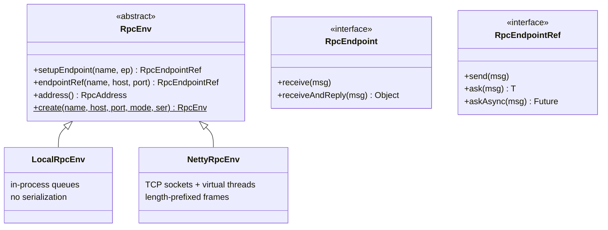
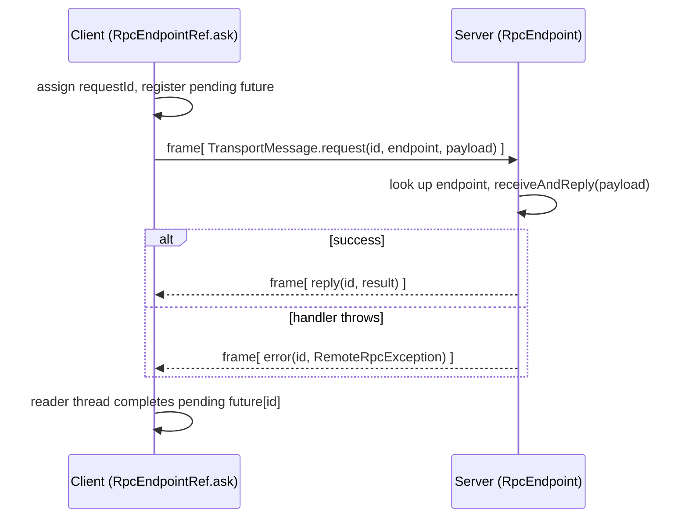

# Component: RPC layer (`minispark-rpc`)

The messaging seam. Everything that crosses a component boundary — driver↔executor,
executor↔executor block fetches, AM↔RM — goes through `RpcEnv`. Swapping the
transport (in-process vs TCP) changes nothing above this interface.

**Real Spark equivalent:** `org.apache.spark.rpc.RpcEnv` (NettyRpcEnv).

## Key abstractions

| Class | Role |
|-------|------|
| `RpcEnv` | Factory + registry. `setupEndpoint(name, ep)` publishes a handler; `endpointRef(name, host, port)` gets a handle. |
| `RpcEndpoint` | A named message handler: `receive` (one-way) and `receiveAndReply` (request/response). |
| `RpcEndpointRef` | A handle to a (possibly remote) endpoint: `send`, `ask`, `askAsync`. Serializable so it can travel inside messages. |
| `RpcAddress` | `host:port`. |
| `Serializer` | Pluggable wire format. `JavaSerializer` today; isolated so Kryo could drop in. |
| `RemoteRpcException` | Carries a remote failure's class+message back across the wire. |

## The seam: one interface, two transports



- **`LocalRpcEnv`** — endpoints live in a name→handler map; `send` dispatches on a
  virtual-thread pool, `ask` is a direct call. **No serialization** (same-JVM fast path).
- **`NettyRpcEnv`** — real TCP. One server socket + on-demand cached client
  connections, each served by a virtual thread (blocking I/O, cheap on Java 21).

## Netty wire protocol

Every frame is `[int length][serialized TransportMessage]`. A `TransportMessage`
distinguishes one-way / request / reply / error and carries a `requestId` to
correlate an `ask` with its reply.



**Why blocking sockets + virtual threads, not NIO selectors:** a selector-based
reactor scales to more connections per OS thread, but the blocking model reads
top-to-bottom with no callback indirection, and Java 21 virtual threads make
"thousands of blocked threads" cheap. The trade-off is documented in
`NettyRpcEnv`.

## Selecting the transport

```java
RpcEnv env = RpcEnv.create("driver", host, port, /*mode*/ "netty", serializer);
// mode = "local"  → LocalRpcEnv
// mode = "netty"  → NettyRpcEnv  (port 0 = ephemeral, read back via env.address())
```

`MiniSparkContext` picks the mode from `minispark.rpc.mode` (or forces `netty`
when the master is `miniyarn://…`).

## Tests

`minispark-rpc/src/test/.../RpcEnvTest` runs the **same** ping/ask/error
contract against `LocalRpcEnv` and against two real `NettyRpcEnv`s over
loopback TCP — proving the seam is behaviorally identical.
