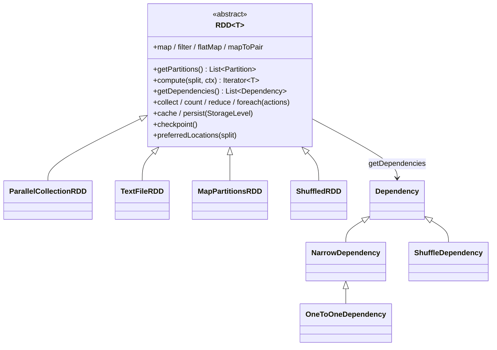
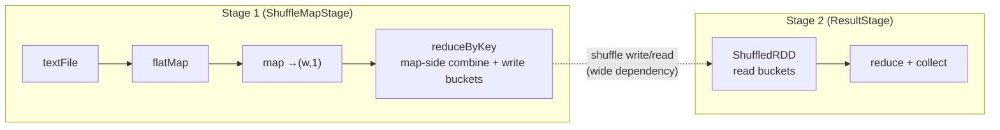
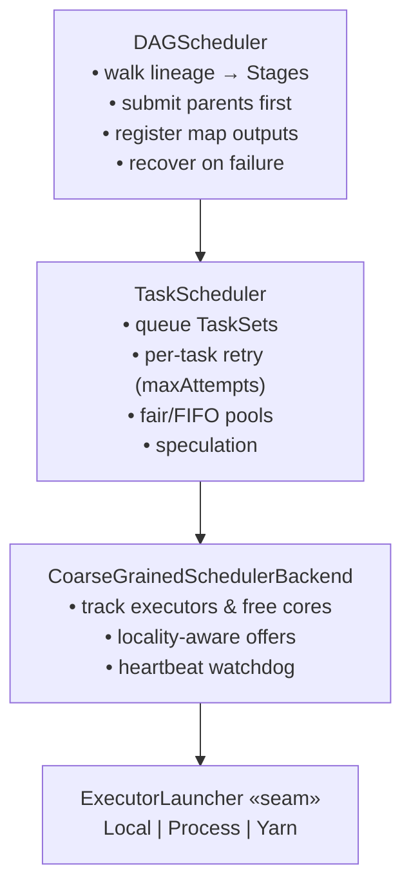
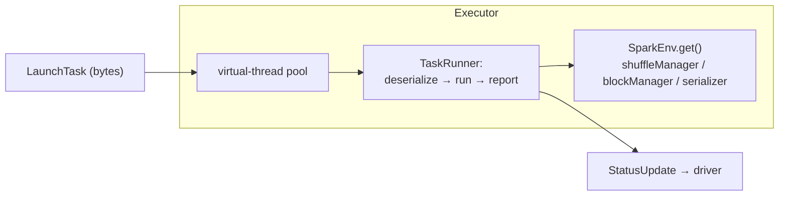
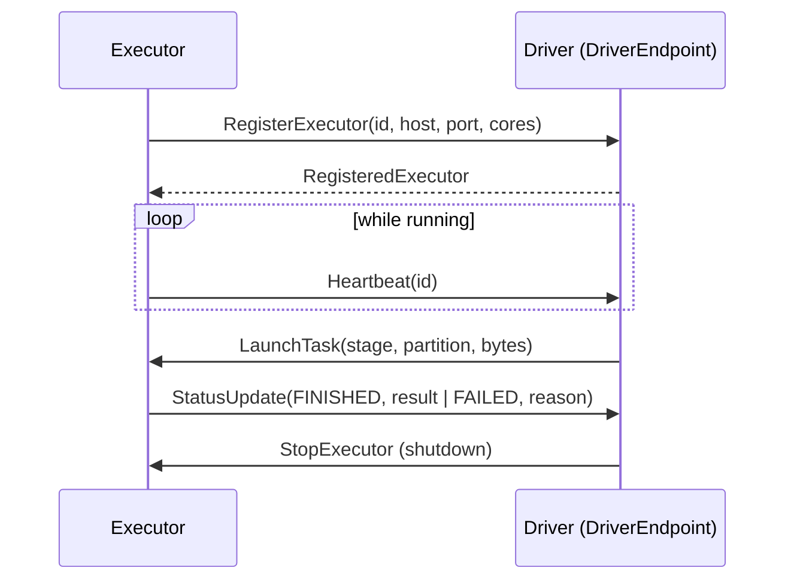

# Component: Core engine (`minispark-core`)

The compute engine: lazy RDDs, the DAG and Task schedulers, the coarse-grained
backend, and the executor. This is the heart of MiniSpark.

## RDD model

An **RDD** is an immutable, partitioned, lazily-evaluated collection. Three
methods define any concrete RDD; transformations build a lineage DAG and run
nothing until an action.

| RDD | Source |
|-----|--------|
| `ParallelCollectionRDD` | a `List<T>` split into N partitions |
| `TextFileRDD` | a file **or directory** of files, byte-split into partitions |
| `MapPartitionsRDD` | map/filter/flatMap (narrow, one-to-one) |
| `ShuffledRDD` | the read side of a shuffle (wide dependency) |

**Why lazy:** returning a new RDD instead of computing immediately lets the
scheduler see the whole pipeline, fuse narrow ops into one stage, and recompute
lost partitions from lineage. `PairRDDFunctions` adds `reduceByKey`,
`groupByKey`, `join`, `cogroup`, `sortByKey` (each introduces a shuffle).

## Narrow vs wide — why a shuffle is a stage boundary

A **narrow** dependency (each child partition reads a bounded, known set of
parent partitions) pipelines inside a stage. A **wide** dependency (each child
partition needs data from *all* parents) forces the parent's output to be
materialized by key first — that materialization point is the stage boundary.

## Scheduler stack

- **`DAGScheduler`** turns the final RDD + action into `ShuffleMapStage`s feeding
  a `ResultStage`; submits parents first; registers each map output's location
  with the `MapOutputTracker`; drives recovery (see
  [fault tolerance](04-fault-tolerance-scaling.md)).
- **`TaskScheduler`** owns per-partition state (attempts, completion, result),
  retries failures up to `maxAttempts`, orders offers via the
  [fair-scheduler pools](04-fault-tolerance-scaling.md), and runs the speculator.
- **`CoarseGrainedSchedulerBackend`** is the only `SchedulerBackend` impl: it
  dispatches tasks to long-lived executors over `RpcEnv`, tracks free cores, and
  detects lost executors via heartbeats. Local vs distributed differ **only** in
  the `ExecutorLauncher`.

## Executor

- Each task runs on its **own virtual thread** (Java 21) — Spark's "task = thread"
  model without OS-thread cost.
- Tasks never carry services; they look them up via the per-JVM `SparkEnv`
  singleton, so the same task object works on the driver (local mode) or a remote
  executor JVM.
- **Every task is serialized before launch, even in local mode** — this forced
  all closures to be shippable from day one and caught real distribution bugs early.

## The driver↔executor protocol (`ClusterMessages`)

## Where to look

| Concern | Class |
|--------|-------|
| RDD base + transformations/actions | `rdd/RDD.java` |
| Pair ops (reduceByKey/join/…) | `api/PairRDDFunctions.java` |
| Stage cutting + recovery | `scheduler/DAGScheduler.java` |
| Retries / pools / speculation | `scheduler/TaskScheduler.java` |
| Executor dispatch + heartbeats | `scheduler/cluster/CoarseGrainedSchedulerBackend.java` |
| Task execution | `executor/Executor.java`, `scheduler/cluster/CoarseGrainedExecutorBackend.java` |
| Context wiring + config | `api/MiniSparkContext.java`, `api/MiniSparkConf.java` |
