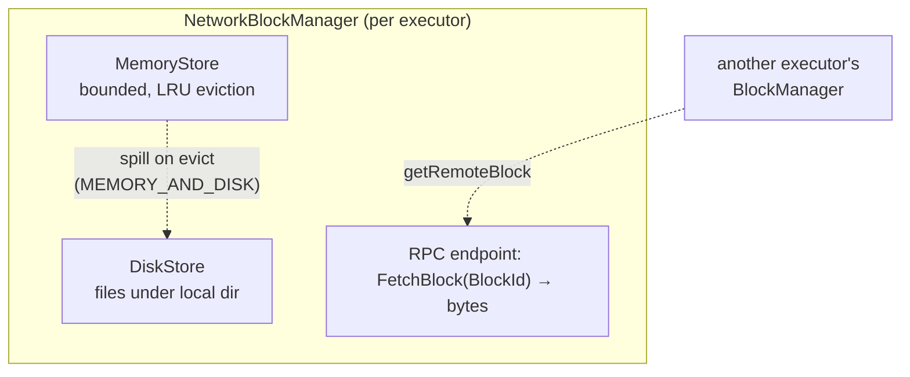
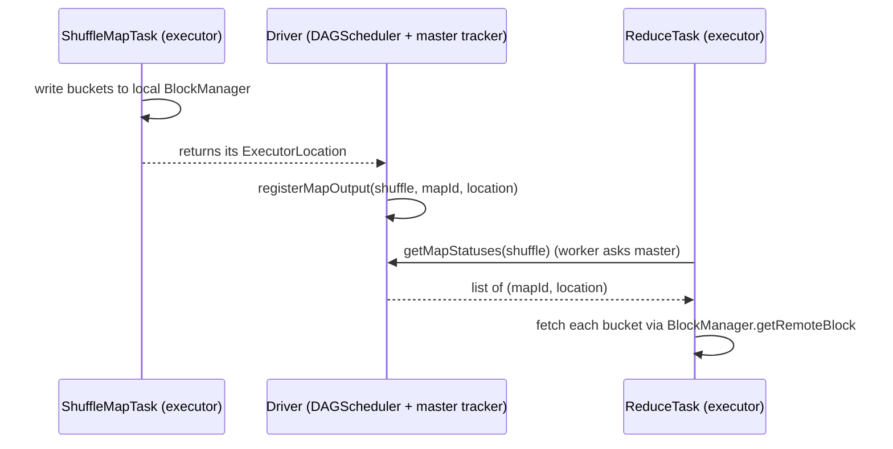
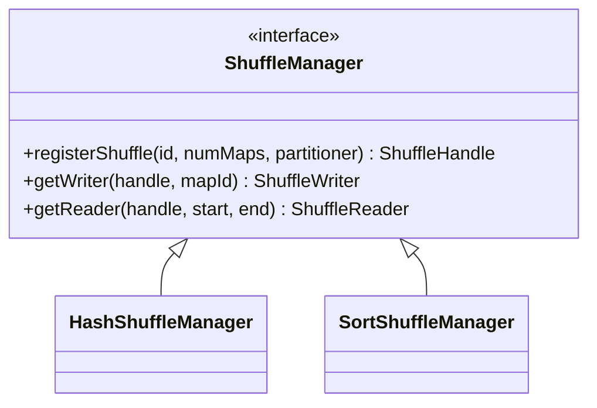
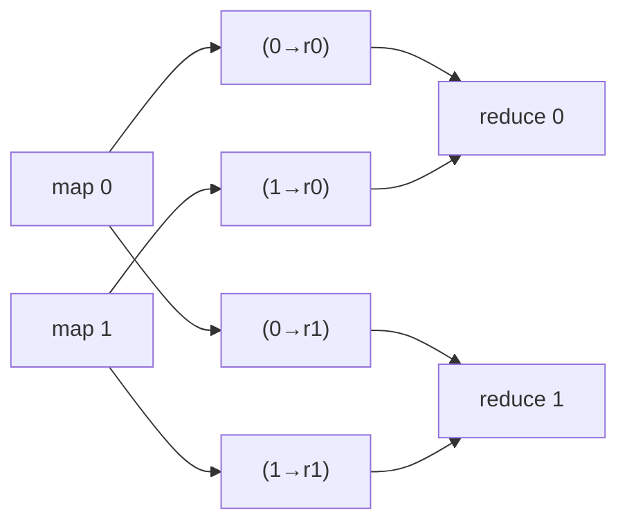
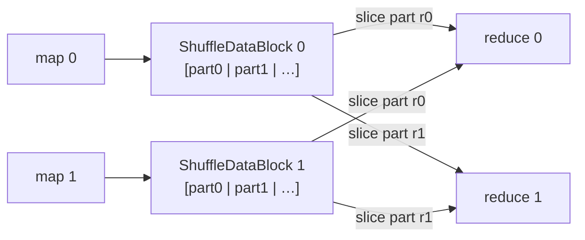
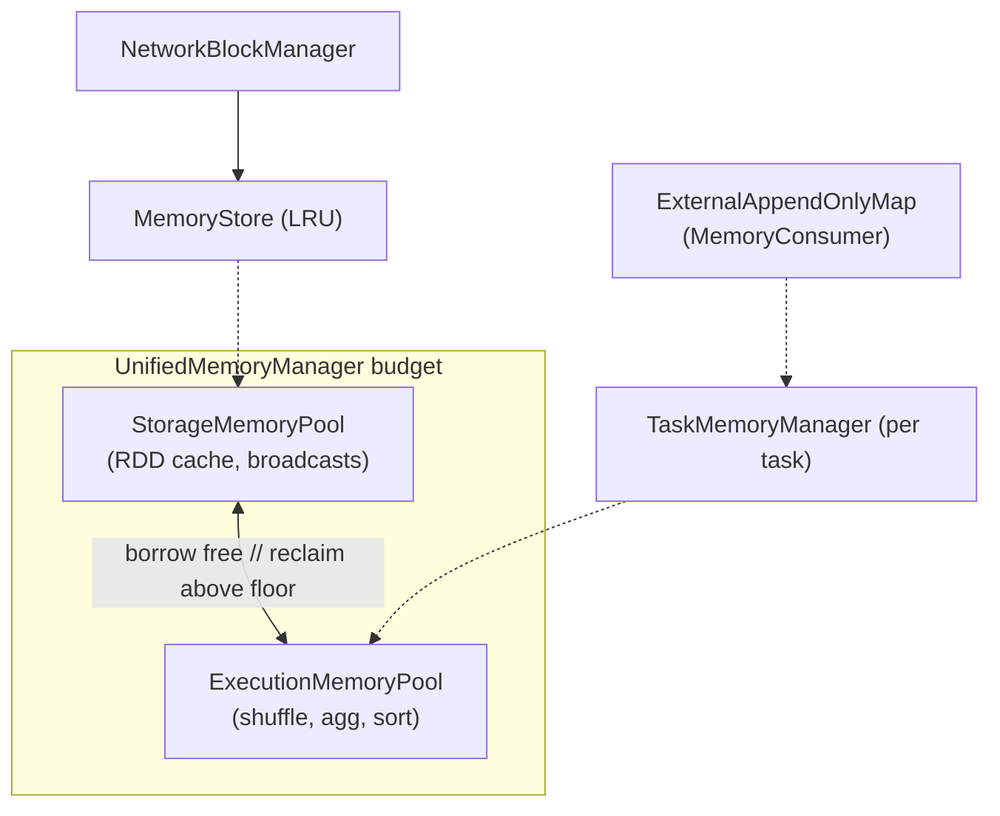

# Component: Storage & Shuffle (`minispark-core`)

How partition bytes are stored, fetched across the network, and exchanged
between map and reduce tasks.

## BlockManager — the storage seam

Every executor (and the driver) runs one `NetworkBlockManager`, publishing a
`"BlockManager"` RPC endpoint. It addresses everything by `BlockId` and serves a
two-tier local store with remote fetch.

| BlockId kind | Used for |
|--------------|----------|
| `ShuffleBlock(shuffle, map, reduce)` | hash-shuffle bucket |
| `ShuffleDataBlock(shuffle, map)` | sort-shuffle consolidated map output |
| `RDDBlock(rdd, partition)` | a cached RDD partition |
| `BroadcastBlock(id)` | a broadcast variable |

**Storage levels** (`StorageLevel`): `MEMORY_ONLY` (drop if it won't fit →
recompute), `MEMORY_AND_DISK` (spill instead of dropping), `DISK_ONLY`.
`MemoryStore` is bounded (`minispark.memory.store.maxBytes`) and LRU-evicts
*evictable* cache blocks; shuffle/broadcast blocks are pinned.

## MapOutputTracker — where shuffle outputs live

Split into a driver **master** (authoritative) and executor **workers**.

The driver registers map-output locations from completed map tasks; reducers ask
the master for the locations, then pull buckets from the owning executors. (No
worker-side caching — recoveries change locations, so every lookup is fresh.)

## The shuffle seam — two implementations

Selected by `minispark.shuffle.manager = hash | sort`. Driver and executors must
agree (the choice is forwarded to executor JVMs as a `-D`).

### Hash shuffle (default)

Each map task writes **one bucket per reducer** (`numMaps × numReduces` blocks).
Simple; the historical Spark design.

### Sort shuffle

Each map task writes **one consolidated block** holding all reduce partitions
back-to-back, with per-partition counts acting as an index. `numMaps` blocks
regardless of reducer count — this is why real Spark switched defaults (hash
shuffle's file count explodes at scale).

**Map-side combine:** `reduceByKey` folds each partition into partial results
*before* the shuffle, so only one value per key per partition crosses the
network — the same win over `groupByKey` that real Spark has.

## Partitioners

`HashPartitioner` (`hash(key) mod n`, MIN_VALUE-safe) and `RangePartitioner`
(samples the data to build sorted range bounds; backs `sortByKey` / `ORDER BY`).

## Memory management

The executor's heap budget (`minispark.memory.store.maxBytes`, default 512 MB)
is divided into two pools by `UnifiedMemoryManager`:

- **StorageMemoryPool** — `MemoryStore` calls `acquireStorageMemory` on
  `putBlock` and `releaseStorageMemory` on eviction. Borrows free bytes
  from the execution pool when the cache fills past its initial fraction.
- **ExecutionMemoryPool** — `TaskMemoryManager` per task; fair-share cap of
  `poolSize / numActiveTasks` so one fat group can't starve siblings.
  Asks peer `MemoryConsumer`s to spill when the pool is full. May reclaim
  storage bytes down to the `storageFraction` floor by evicting LRU cache.
- **ExternalAppendOnlyMap** — the spillable hash used by
  `PairRDDFunctions.combine` (and therefore every `reduceByKey` /
  `HashAggregateExec`). When `acquireExecutionMemory` returns less than
  asked, it dumps its in-memory state to a `BlockId.SpillBlock` on disk,
  resets, and continues. `iterator()` merges in-memory entries with all
  spill files by hash-bucket, combining same-key values. The single most
  impactful Spark feature for surviving wide group-by queries on
  constrained heaps. Real Spark equivalent:
  `org.apache.spark.util.collection.ExternalAppendOnlyMap`.

JVM heap enforcement: `ProcessExecutorLauncher` and `YarnExecutorLauncher`
now pass `-Xmx{memoryMB}m` to the spawned executor JVM, so the configured
budget is real, not advisory. The YARN launcher reserves the larger of
384 MB or 10% of the container as `memoryOverhead`.

Not yet implemented: spillable shuffle writers
(`org.apache.spark.shuffle.sort.ExternalSorter`) and off-heap Tungsten
unsafe rows.

## Broadcast variables

`sc.broadcast(value)` writes the value into the driver's BlockManager once; the
returned `TorrentBroadcast` handle is tiny (id + driver location). Each executor
fetches-and-caches the value on first `.value()` — so a big lookup table ships
once per executor, not once per task.

## Where to look

| Concern | Class |
|--------|-------|
| Block store + remote fetch | `storage/NetworkBlockManager.java`, `MemoryStore`, `DiskStore` |
| Block identity | `storage/BlockId.java` |
| Map-output registry | `storage/MapOutputTracker.java` |
| Hash / sort shuffle | `shuffle/HashShuffleManager.java`, `SortShuffleManager.java` |
| Memory pools | `memory/MemoryPool.java`, `StorageMemoryPool.java`, `ExecutionMemoryPool.java` |
| Unified manager + task accounting | `memory/UnifiedMemoryManager.java`, `TaskMemoryManager.java` |
| Spillable hash (aggregation) | `memory/ExternalAppendOnlyMap.java`, `MemoryConsumer.java` |
| Partitioning | `shuffle/HashPartitioner.java`, `RangePartitioner.java` |
| Broadcast | `broadcast/TorrentBroadcast.java` |
