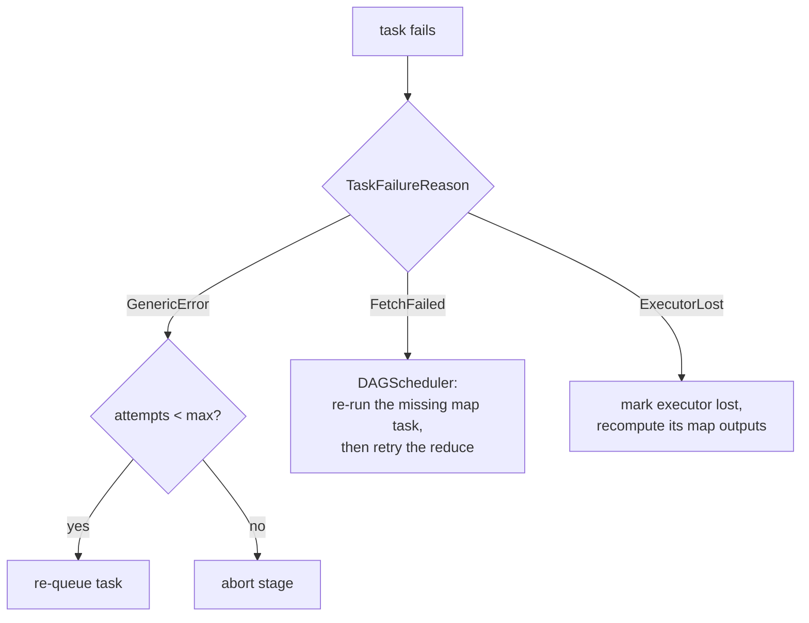
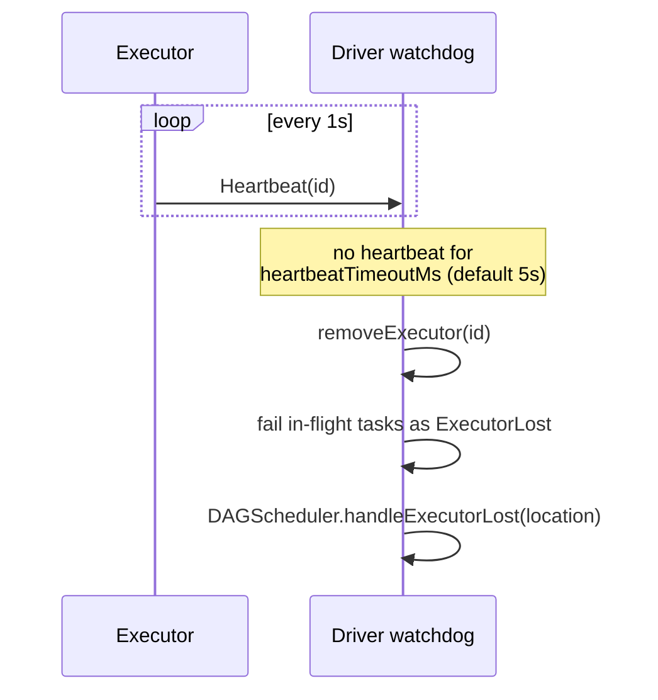
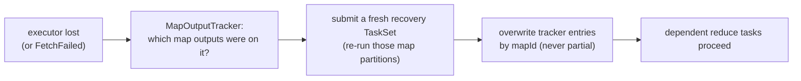
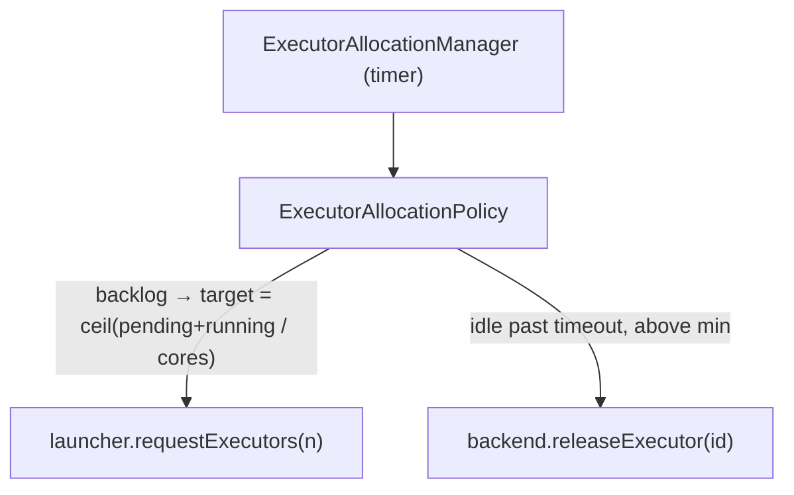
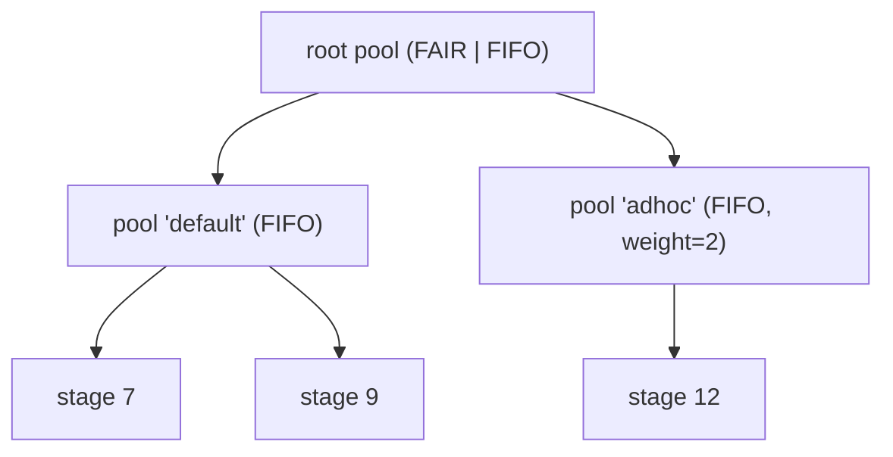

# Component: Fault tolerance & scaling (`minispark-core`)

What makes RDDs *Resilient* and the cluster *elastic*: task retry, lineage
recovery, executor-loss detection, speculation, dynamic allocation, and fair
scheduling pools.

## Task retry & structured failures

A task failure carries a structured `TaskFailureReason` (not a string), so the
driver can react to each kind specifically.

`TaskScheduler` keeps per-partition attempts and retries up to `maxAttempts`
(default 4); duplicate completions (a retry racing the original) are ignored —
first success wins.

## Heartbeats & lost-executor detection

## Lineage recovery — the "R" in RDD

When an executor dies, the shuffle map outputs it produced are gone. The
`DAGScheduler` recomputes exactly those partitions from lineage and re-registers
the new locations — no replication, no checkpointing required.

Two invariants make this correct: outputs are **overwritten, never removed
first** (a concurrent reducer always sees a complete `numMaps` set), and a
`deadLocations` set lets the driver rebuild map results that landed on a
now-dead executor *before* publishing them (avoiding a slow per-reducer
FetchFailed storm). Verified by `ExecutorFailureRecoveryTest`, which kills an
executor mid-job and asserts the result is still correct.

## Checkpointing

`rdd.checkpoint()` (after `sc.setCheckpointDir`) writes each partition to
reliable storage on the next action. The `DAGScheduler` then **stops walking
lineage** at a checkpointed RDD — truncating recompute for long iterative jobs.

## Speculative execution

Optional (`minispark.speculation=true`). A background poller watches in-flight
tasks; once a stage is mostly done, it relaunches a straggler running far longer
than the median. The "first success wins" rule means the duplicate never
double-counts.

## Dynamic allocation

The cluster grows and shrinks with load.

The decision (`ExecutorAllocationPolicy`) is a pure function — unit-tested in
isolation — clamped to `[min, max]` and net of outstanding requests so it never
over-provisions. Proven by `DynamicAllocationTest` (cluster grows 1 → 4 under a
12-task backlog).

## Fair scheduler pools

A two-level scheduling tree decides which stage gets the next resource offer.

`minispark.scheduler.mode = FAIR` shares resources across pools by weight and
`minShare`; `sc.setSchedulerPool(name)` tags a thread's jobs. FAIR ordering
(honor minShare, then prefer lower weighted load) is a pure comparator,
unit-tested in `SchedulingAlgorithmsTest`.

## Locality-aware scheduling

`RDD.preferredLocations(partition)` flows into each `Task`; the backend prefers a
free executor on a preferred host (NODE_LOCAL) and falls back to any free
executor (ANY) — the core of Spark's locality ladder. Decision isolated in
`LocalityScheduler` and unit-tested.

## Where to look

| Concern | Class |
|--------|-------|
| Failure reasons | `scheduler/cluster/TaskFailureReason.java` |
| Retry / speculation / pools wiring | `scheduler/TaskScheduler.java` |
| Heartbeats / lost executor / release | `scheduler/cluster/CoarseGrainedSchedulerBackend.java` |
| Lineage recovery + checkpoint truncation | `scheduler/DAGScheduler.java` |
| Dynamic allocation | `scheduler/cluster/ExecutorAllocationManager.java`, `ExecutorAllocationPolicy.java` |
| Fair pools | `scheduler/pool/*` |
| Locality | `scheduler/cluster/LocalityScheduler.java` |
