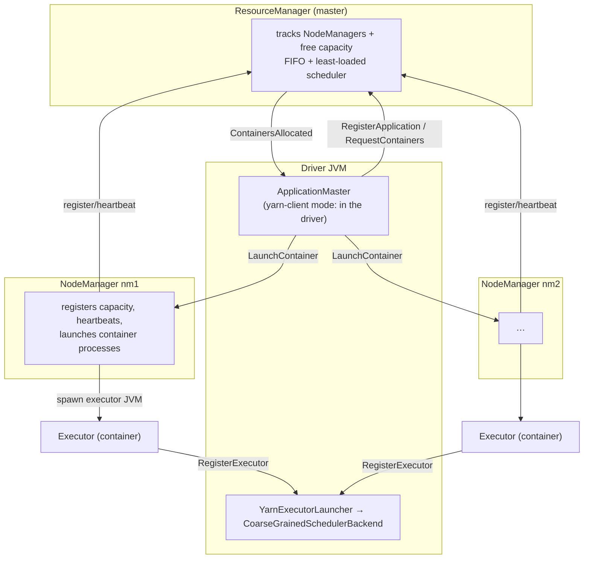
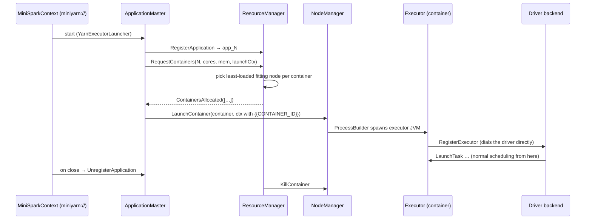
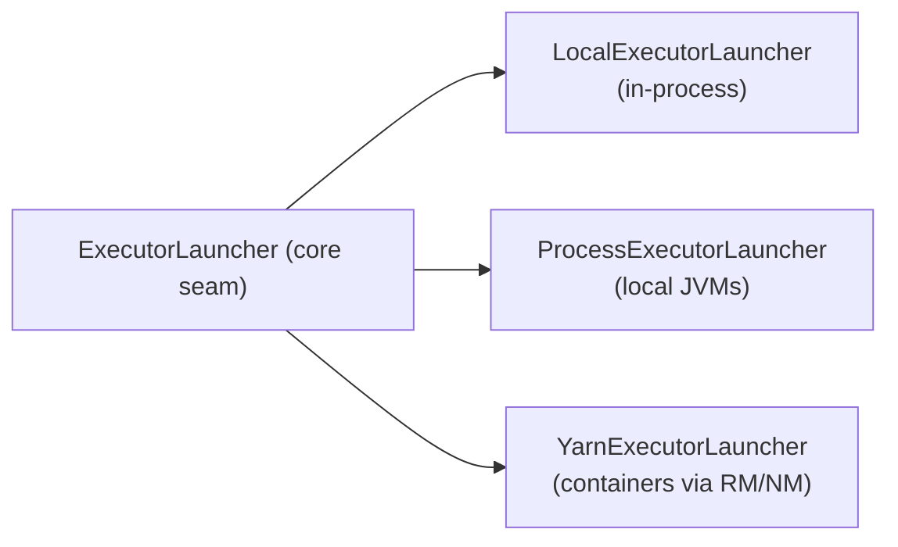

# Component: MiniYarn cluster manager (`miniyarn`)

A YARN-like resource manager that allocates executor processes across nodes. It
is what turns `setMaster("miniyarn://host:8032")` into real containers on real
NodeManagers.

**Real equivalents:** Hadoop YARN `ResourceManager` / `NodeManager`, and Spark's
`ApplicationMaster` + `YarnAllocator`.

## The cast

## Full job lifecycle (Spark-on-YARN, mirrored)

## Wire protocol (`YarnMessages`)

| Direction | Messages |
|-----------|----------|
| NM → RM | `RegisterNodeManager`, `NodeHeartbeat` (free capacity + container statuses) |
| AM → RM | `RegisterApplication`, `RequestContainers`, `ReleaseContainer`, `UnregisterApplication` |
| RM → AM | `ContainersAllocated` |
| AM → NM | `LaunchContainer`, `KillContainer` |
| NM → AM | `ContainerCompleted` |

## Scheduler

The RM runs a single-threaded **FIFO with least-loaded placement**: for each
pending demand it packs containers onto the node with the most free cores that
still fits, spreading executors across the cluster. Allocation and launch are
**separate hops** (RM only reserves; the AM tells the NM to actually start),
exactly like real YARN.

## The integration point: one class

`YarnExecutorLauncher` is the third implementation of the core engine's
`ExecutorLauncher` seam (alongside `Local` and `Process`). The
`DAGScheduler`/`TaskScheduler`/`CoarseGrainedSchedulerBackend` are **unchanged** —
the executor JVMs the NodeManagers spawn are the same `CoarseGrainedExecutorBackend.main`
used everywhere, and they dial back to the driver over the same Netty RPC.

## Running it (separate processes)

See the **[Runbook](../RUNBOOK.md#cluster-mode-miniyarn)**. In short:
`scripts/start-rm.sh` → `scripts/start-nm.sh nm1 …` (×N) → `scripts/submit-yarn.sh`.

## Where to look

| Concern | Class |
|--------|-------|
| Resource model | `common/Resource.java`, `Container.java`, `ContainerId.java` |
| Wire protocol | `common/YarnMessages.java` |
| Master + scheduler | `rm/ResourceManager.java` |
| Node agent + container launch | `nm/NodeManager.java` |
| Per-app broker | `am/ApplicationMaster.java` |
| Engine integration | `minispark-core …/cluster/YarnExecutorLauncher.java` |
