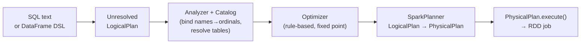
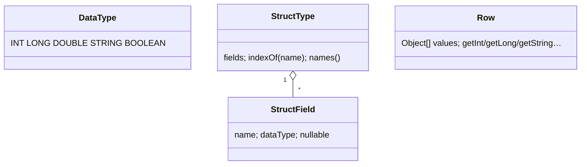
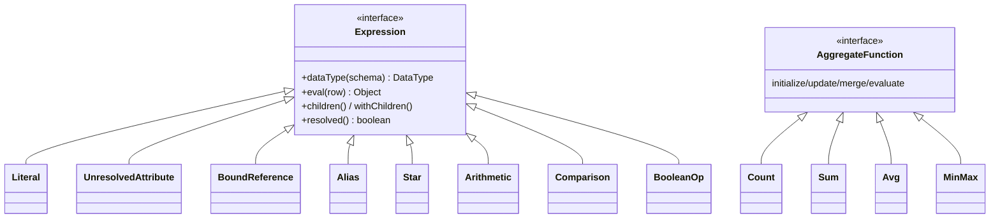
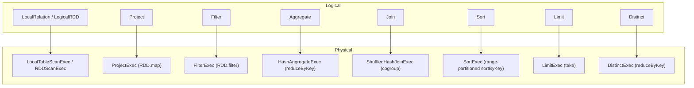
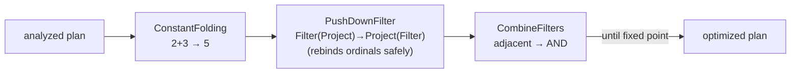

# Component: SQL / DataFrame (`minispark-sql`)

A miniature **Catalyst**: a schema-typed DataFrame API and a SQL string parser
that compile down to the RDD engine through the same four stages as real Spark
SQL — **analyze → optimize → plan → execute**. The DataFrame DSL and `spark.sql(...)`
share one execution path.

## The compilation pipeline



## Type system & rows



`Row` is positional and `Serializable` (it crosses the shuffle like any record).

## Expression tree

Every `Expression` reports its output `DataType` against an input schema,
`eval`s against a `Row`, and exposes `children`/`withChildren` for generic
rewriting.



The analyzer rewrites each `UnresolvedAttribute` (a name) into a
`BoundReference` (an ordinal + type), so `eval` is a direct array access on the
hot path — no per-row name lookup.

## Logical plan ↔ Physical plan



Every physical operator lowers to an RDD transformation, so SQL **inherits the
full distributed engine** — shuffle, fault tolerance, locality, the lot.

## Aggregation & joins through the shuffle

- **`GROUP BY`** → `HashAggregateExec` → `reduceByKey`, giving map-side combine
  for free. `Avg` carries a `(sum,count)` buffer so partial averages merge
  correctly. An empty global aggregate (`count(*)` over no rows) still returns
  one seeded row.
- **`JOIN`** (INNER/LEFT/RIGHT/FULL) → `ShuffledHashJoinExec` → `cogroup`: both
  sides keyed and shuffled, per-key cartesian product, null-padding the empty
  side for outer joins. Join/group keys are normalized (`Integer 5 == Long 5`)
  and null join keys are made unique so SQL's "null never matches null" holds.

## Optimizer (rule-based, fixed point)



`PushDownFilter` rebinds each `BoundReference` by name against the child schema
as it pushes (since the analyzer already turned names into output-schema
ordinals) — and refuses to push when a needed column isn't available downstream.

### Adaptive Query Execution (runtime re-plan)

The compile-time optimizer above doesn't know how much data each shuffle bucket
will contain — that's only knowable once the upstream map stage runs. AQE
(opt-in via `minispark.sql.adaptive.enabled=true`) waits for the map stage to
materialise and then re-plans the downstream stage from the real per-reducer
byte sizes reported by `MapOutputTracker`. The one rule implemented is
`CoalesceShufflePartitionsRule`: contiguous reducers whose summed bytes fall
under the target are fused into a single post-shuffle task. Lives in the
scheduler (`scheduler.adaptive.CoalesceShufflePartitionsRule`) because it
operates at the RDD/stage layer — DataFrame jobs benefit automatically since
their physical plans compile down to ShuffledRDDs. See
[INTERNALS-DISTRIBUTED-FLOW §7.5](../INTERNALS-DISTRIBUTED-FLOW.md#75-aqe-coalesce--optional-re-plan-between-map-and-reduce)
for the end-to-end trace.

### Join strategy selection

The planner picks among three physical join operators:

| Operator | When picked | Cost shape |
|----------|-------------|------------|
| `BroadcastHashJoinExec` | one side has a `df.broadcast()` hint, **or** one side is a `LocalRelation` under `minispark.sql.autoBroadcastJoinThreshold.rows` (default 1000) | small side collected to driver → one broadcast hop per executor; streaming side never shuffled |
| `SortMergeJoinExec` | not broadcast-eligible, and `minispark.sql.join.preferSortMergeJoin=true` | both sides shuffled through the **same** partitioner, then zipped per partition; each partition sorts its two sides and merge-iterates |
| `ShuffledHashJoinExec` | the default non-broadcast fallback, **and always for FULL OUTER when SMJ is off** | both sides bucketed by join key via a `CoGroupedRDD` shuffle; one in-memory hash table per key group |

Selection logic lives in `SparkPlanner.planJoin`. Broadcast wins over
sort-merge wins over shuffled-hash, with the eligibility checks:

- The broadcast hint (`plan.BroadcastHint`) is a logical pass-through node
  that survives optimizer rewrites. Build-side eligibility per join type is
  enforced in `BroadcastHashJoinExec.{canBuildLeft, canBuildRight}` —
  broadcasting the LEFT side is only safe for INNER and RIGHT joins
  (a LEFT outer would need to know which build-side rows had no probe
  match, which a map-only operator can't report). FULL OUTER never
  broadcasts.
- Sort-merge handles all four join types (INNER/LEFT/RIGHT/FULL) directly
  in its merge loop. The "real Spark uses SMJ as the default" payoff is
  the ability to stream sorted shuffle data without materialising a full
  hash table per key group — in MiniSpark we still sort in memory, so the
  benefit is pedagogical, not memory-real.

What's NOT implemented yet: runtime demotion (turn a planned
`ShuffledHashJoinExec` or `SortMergeJoinExec` into `BroadcastHashJoinExec`
after a parent map stage materialises and one side turns out small). That
needs a query-stage materialisation barrier in the SQL planner — a natural
follow-on to `CoalesceShufflePartitionsRule`.

## SQL parser

Hand-written **lexer → recursive-descent parser** producing an unresolved
`LogicalPlan`. Supports:

```sql
SELECT [DISTINCT] expr [AS alias], … | *
FROM table [ [INNER|LEFT|RIGHT|FULL] [OUTER] JOIN table ON a = b [AND …] ]
[WHERE predicate]
[GROUP BY expr, …]
[HAVING predicate]
[ORDER BY expr [ASC|DESC], …]
[LIMIT n]
```

with full precedence (`OR < AND < comparison < +/- < */÷ < primary`) and
`count/sum/avg/min/max`. Aggregates appearing anywhere in SELECT/HAVING/ORDER BY
(e.g. `sum(x)+1`) are gathered into one `Aggregate` node and the surrounding
expressions are rewritten to reference its output columns.

## Entry points

```java
MiniSparkSession spark = MiniSparkSession.builder("app", "local[4]");
DataFrame df = spark.createDataFrame(rows, schema);     // or spark.read().csv(path)
df.createOrReplaceTempView("people");

// DSL
df.filter(col("age").ge(30)).select("name","city").show();

// SQL text — same engine underneath
spark.sql("SELECT city, count(*) FROM people GROUP BY city HAVING count(*) > 1").show();

// EXPLAIN: analyzed / optimized / physical trees
System.out.println(df.explain());
```

## Batch file I/O

`spark.read().option("header",true).option("inferSchema",true).csv(path)` and
`.json(path)` (read a file *or* a directory of part-files); `df.write().csv(path)`
/ `.json(path)` write one `part-NNNNN` per partition via the engine's
`saveAsTextFile`. Round-trip: read → query → write → read.

## Where to look

| Concern | Class(es) |
|--------|-----------|
| User API | `MiniSparkSession`, `DataFrame`, `Column`, `GroupedData`, `functions` |
| Types & rows | `types/*`, `Row` |
| Expressions | `expr/*`, `expr/agg/*` |
| Logical plans | `plan/*` |
| Analyzer + catalog | `analysis/Analyzer.java`, `Catalog.java` |
| Optimizer | `optimizer/*` |
| Planner + physical ops | `execution/*` |
| SQL parser | `parser/*` |
| File sources | `DataFrameReader`, `DataFrameWriter`, `sources/*` |
