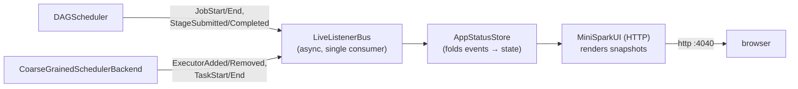

# Component: Web UI & observability (`minispark-core`)

A read-only web UI built the way Spark builds its own: **event-sourced**, never
reaching into the live scheduler.

## Event flow



- **`LiveListenerBus`** — the scheduler `post()`s `SchedulerEvent`s onto a queue
  drained by a **single daemon thread** that notifies listeners in order.
  Posting is non-blocking, so a slow listener can't stall scheduling, and
  listeners need no internal locking.
- **`AppStatusStore`** — a `SchedulerListener` that folds the event stream into
  current job/stage/executor state and hands out **immutable snapshots**, so the
  UI thread never races the dispatch thread.
- **`MiniSparkUI`** — the JDK's built-in `com.sun.net.httpserver.HttpServer`
  (zero deps) serves two self-refreshing pages:
  - **`/`** — Executors, Jobs, Stages (with progress bars).
  - **`/dag`** — the stage DAG, one diagram per job, as inline SVG (no JS/CDN,
    works offline). Nodes are stages (id · type · task progress, coloured by
    status); arrows are shuffle boundaries (parent → child). Laid out
    left-to-right by dependency level — the shuffle-producing parents on the
    left, the `ResultStage` on the right.

The UI reads only the store, so it can neither perturb nor be perturbed by
scheduling — exactly Spark's `AppStatusListener`/`AppStatusStore`/`SparkUI`
split.

### How the DAG edges reach the UI

A `Stage` knows its `parents()` while the job runs, but that's gone once the
job ends. So `StageSubmitted` now carries `parentStageIds`, the
`AppStatusStore` records them on each `StageView`, and `/dag` draws the graph
from those edges. The scheduler stores the *full ancestor set* as a stage's
parents (a scheduling convenience), so the UI applies a **transitive
reduction** — it draws only immediate edges, dropping `A→C` when a path
`A→B→C` already exists — to match how Spark renders the DAG.

## Enabling it

```java
new MiniSparkConf()
    .set("minispark.ui.enabled", "true")
    .set("minispark.ui.port", "4040");   // 0 = ephemeral
```

Off by default (so tests don't bind ports). `sc.uiPort()` returns the bound
port. Demo: `WordCountWithUI` (or `scripts/run-ui-demo.sh`) prints the URL and
keeps the driver alive for browsing.

## Events

| Event | Posted by |
|-------|-----------|
| `JobStart` / `JobEnd` | `DAGScheduler` |
| `StageSubmitted` / `StageCompleted` | `DAGScheduler` |
| `TaskStart` / `TaskEnd` | `CoarseGrainedSchedulerBackend` |
| `ExecutorAdded` / `ExecutorRemoved` | `CoarseGrainedSchedulerBackend` |

## Accumulators

`sc.longAccumulator(name)` / `doubleAccumulator` — write-only-on-executors,
read-on-driver counters. Tasks add deltas; the backend merges each task's
accumulator updates into the driver-side registry on `StatusUpdate`, so a value
read after the action reflects every task's contribution.

## Where to look

| Concern | Class |
|--------|-------|
| Event types | `status/SchedulerEvent.java` |
| Bus | `status/LiveListenerBus.java` |
| Store | `status/AppStatusStore.java` |
| UI | `ui/MiniSparkUI.java` |
| Accumulators | `accumulator/*` |
