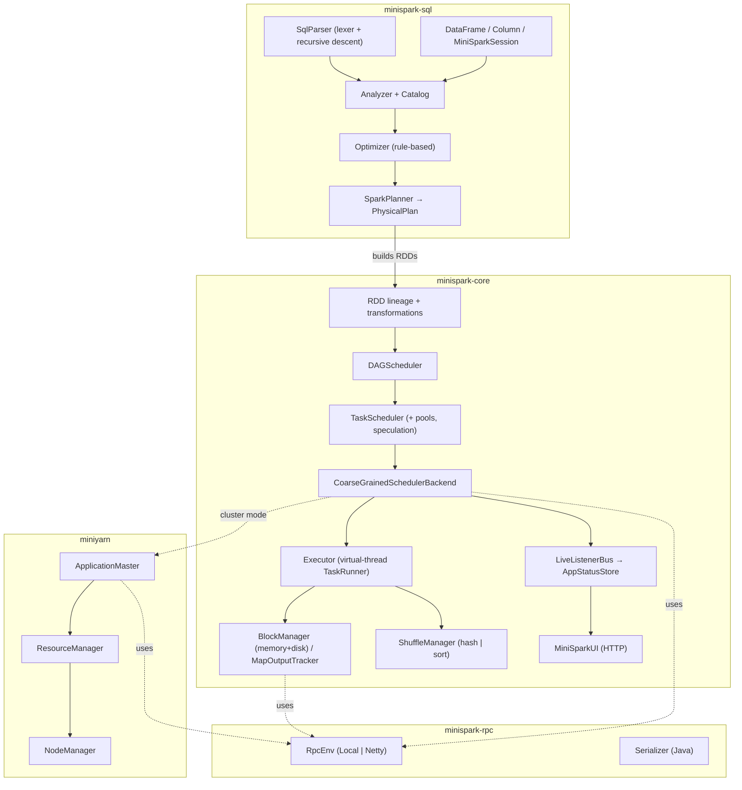
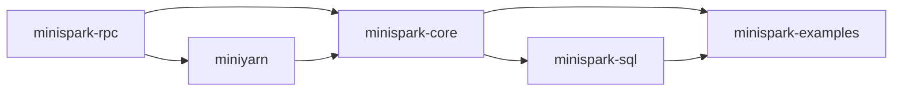

# MiniSpark Components

This folder documents each subsystem of MiniSpark: what it does, how it's
structured, the key classes, and how it maps to real Apache Spark. Diagrams use
[Mermaid](https://mermaid.js.org/) (renders on GitHub).

## Reading order

1. **[RPC layer](01-rpc.md)** — the messaging seam everything else rides on.
2. **[Core engine](02-core-engine.md)** — RDDs, the DAG/Task schedulers, the executor.
3. **[Storage & shuffle](03-storage-shuffle.md)** — block storage tiers and the two shuffle implementations.
4. **[Fault tolerance & scaling](04-fault-tolerance-scaling.md)** — retries, lineage recovery, speculation, dynamic allocation, fair pools.
5. **[MiniYarn](05-miniyarn.md)** — the cluster manager (RM/NM/AM/containers).
6. **[SQL / DataFrame](06-sql.md)** — the miniature Catalyst on top of the engine.
7. **[Web UI & observability](07-ui-observability.md)** — the event bus and status UI.

## The component map

## Module dependencies

## The four seams at a glance

| Interface | Local impl | Distributed impl | Doc |
|-----------|-----------|------------------|-----|
| `SchedulerBackend` | `LocalExecutorLauncher` | `Process` / `Yarn` launcher | [core](02-core-engine.md) |
| `RpcEnv` | `LocalRpcEnv` | `NettyRpcEnv` (TCP) | [rpc](01-rpc.md) |
| `BlockManager` | in-memory only | `NetworkBlockManager` (RPC fetch) | [storage](03-storage-shuffle.md) |
| `ShuffleManager` | `HashShuffleManager` | `SortShuffleManager` | [storage](03-storage-shuffle.md) |
